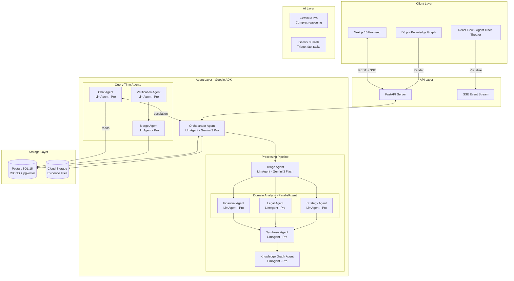
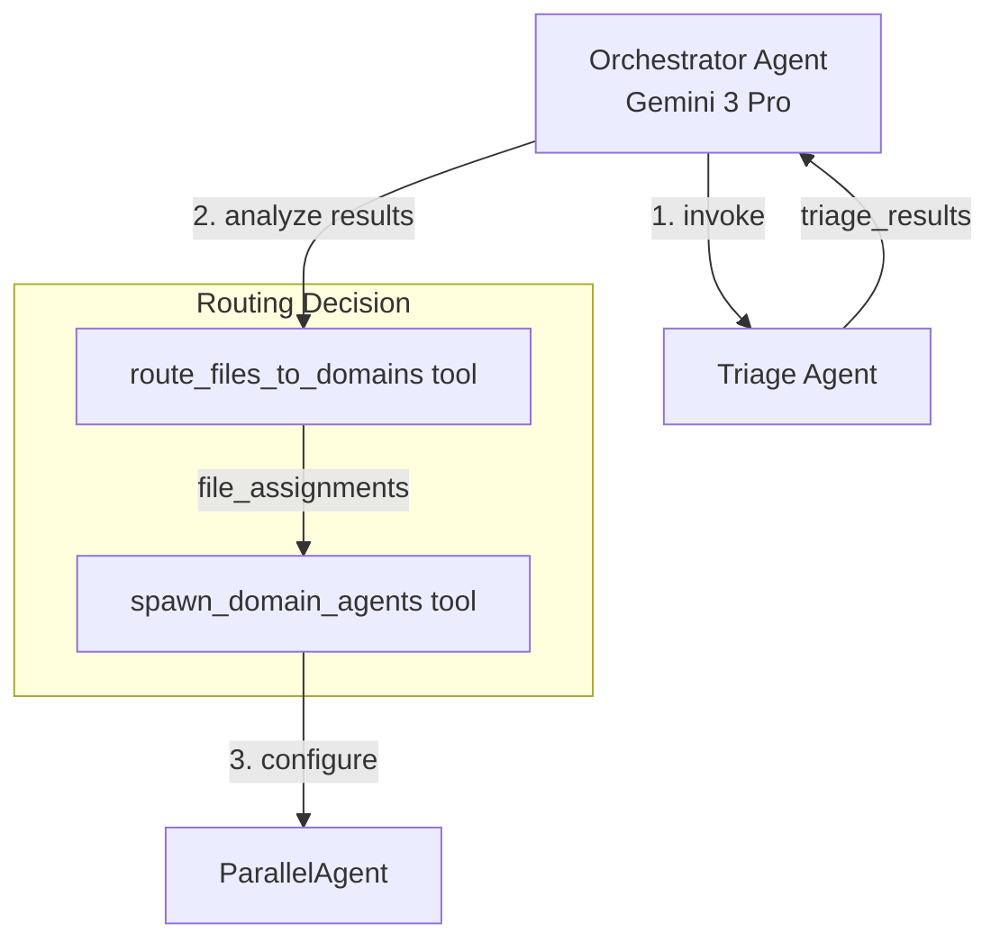
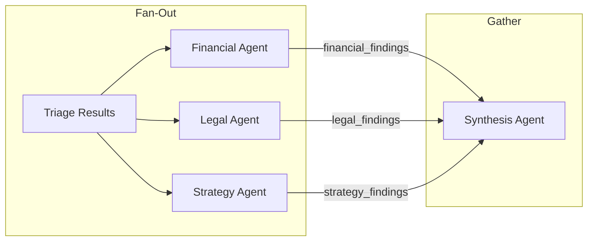
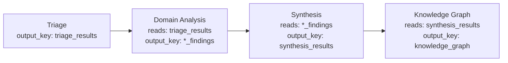
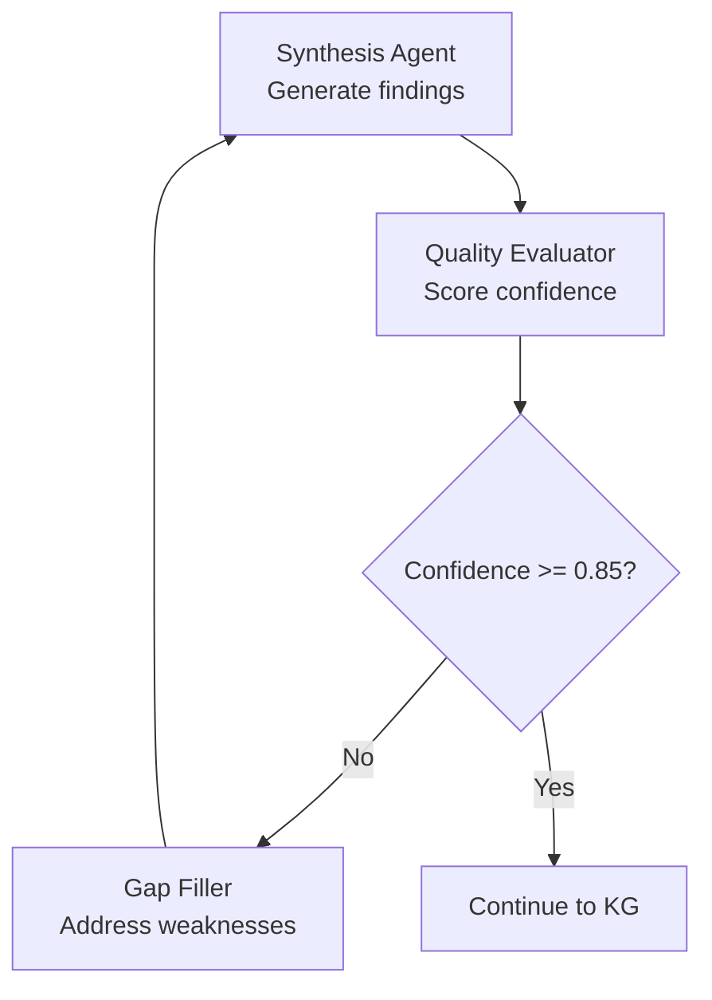
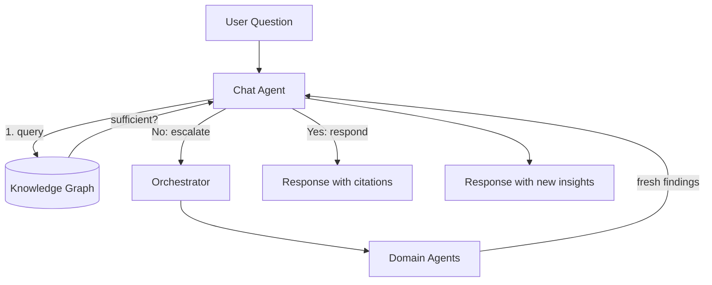
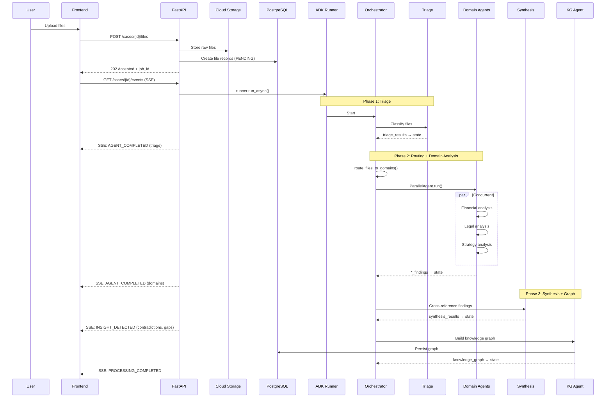
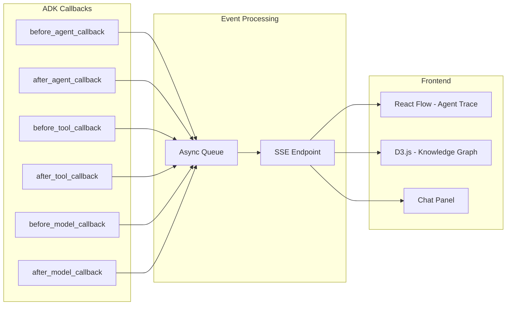

# Architecture Patterns

**Domain:** Legal intelligence platform with multi-agent AI
**Researched:** 2026-01-18
**Confidence:** HIGH (verified with Google ADK documentation, official sources, and existing PRD)

## Executive Summary

Holmes requires a **hierarchical multi-agent architecture** with an intelligent Orchestrator coordinating specialized domain agents. The architecture uses Google ADK's agent primitives (LlmAgent, SequentialAgent, ParallelAgent, LoopAgent) combined with event-driven SSE streaming for real-time transparency. PostgreSQL serves as the unified data layer with JSONB for flexible schemas.

The key insight: **Domain-based agents beat file-type agents** because Gemini 3's native multimodal capabilities allow a single Financial Agent to analyze PDFs, videos, and audio without artificial boundaries.

---

## Recommended Architecture

### High-Level System Architecture



### Component Boundaries

| Component | Responsibility | Communicates With | Technology |
|-----------|---------------|-------------------|------------|
| **Frontend** | UI rendering, SSE consumption, state management | FastAPI (REST+SSE) | Next.js 16, React Flow, D3.js, Zustand |
| **FastAPI Server** | REST endpoints, SSE streaming, job orchestration | ADK Runner, PostgreSQL, GCS | Python FastAPI, async |
| **ADK Runner** | Agent execution, session management, event streaming | All Agents, Session Service | Google ADK |
| **Orchestrator** | Pipeline control, file routing, agent spawning | Triage, Domain Agents, Synthesis | LlmAgent - Gemini 3 Pro |
| **Triage Agent** | Quick classification, domain scoring | Orchestrator (output_key) | LlmAgent - Gemini 3 Flash |
| **Domain Agents** | Deep multimodal analysis per domain | Synthesis (output_key) | LlmAgent - Gemini 3 Pro |
| **Synthesis Agent** | Cross-modal linking, contradictions, gaps | KG Agent (output_key) | LlmAgent - Gemini 3 Pro |
| **KG Agent** | Entity resolution, graph construction | PostgreSQL | LlmAgent - Gemini 3 Pro |
| **Chat Agent** | Knowledge-first Q&A, escalation | PostgreSQL, Orchestrator | LlmAgent - Gemini 3 Pro |
| **Verification Agent** | Validates user corrections | Source files, Merge Agent | LlmAgent - Gemini 3 Pro |
| **Merge Agent** | Incremental KG updates, conflict detection | PostgreSQL | LlmAgent - Gemini 3 Pro |
| **PostgreSQL** | All persistent data, session state | All services | Cloud SQL PostgreSQL 15 |
| **Cloud Storage** | Evidence files, artifacts | FastAPI, Domain Agents | GCS |

---

## Agent Architecture Patterns

### Pattern 1: Hierarchical Orchestration

The Orchestrator is an intelligent LlmAgent (not a dumb router) that uses Gemini 3 Pro to make routing decisions based on triage results.

**What:** Central coordinator analyzes requests and dynamically routes to specialists
**When:** Complex workflows requiring adaptive task decomposition
**Why for Holmes:** Each case has different evidence composition; routing must be intelligent



**ADK Implementation:**
```python
orchestrator = LlmAgent(
    name="Orchestrator",
    model="gemini-3-pro-preview",
    instruction="""You coordinate the investigation pipeline.
    1. Invoke Triage Agent on uploaded files
    2. Analyze triage_results to determine file→domain assignments
    3. Use route_files_to_domains tool to assign files where domain_score >= 0.4
    4. Spawn domain agents with appropriate configuration
    5. Trigger Synthesis and KG phases after domain analysis""",
    tools=[route_files_to_domains, spawn_domain_agents],
    sub_agents=[triage_agent, parallel_domain_agent, synthesis_agent, kg_agent],
    generate_content_config=GenerateContentConfig(
        thinking_config=ThinkingConfig(thinking_level="medium", include_thoughts=True)
    )
)
```

### Pattern 2: Parallel Fan-Out / Gather

Domain agents run concurrently for maximum throughput, with outputs gathered via session state.

**What:** Multiple agents execute simultaneously, results aggregated afterward
**When:** Independent analyses that benefit from parallelization
**Why for Holmes:** Financial, Legal, and Strategy analysis are independent; parallelism reduces total time



**ADK Implementation:**
```python
parallel_domain_analysis = ParallelAgent(
    name="DomainAnalysis",
    sub_agents=[
        LlmAgent(
            name="FinancialAgent",
            instruction="Analyze financial evidence: {file_assignments.financial}",
            output_key="financial_findings"
        ),
        LlmAgent(
            name="LegalAgent",
            instruction="Analyze legal evidence: {file_assignments.legal}",
            output_key="legal_findings"
        ),
        LlmAgent(
            name="StrategyAgent",
            instruction="Analyze strategy evidence: {file_assignments.strategy}",
            output_key="strategy_findings"
        )
    ]
)
```

**Critical:** Each sub-agent must use a unique `output_key` to prevent race conditions in shared session state.

### Pattern 3: Sequential Pipeline

Processing phases execute in strict order where each phase depends on the previous.

**What:** Ordered execution where output of phase N becomes input of phase N+1
**When:** Clear dependencies between processing stages
**Why for Holmes:** Triage → Domain → Synthesis → KG is a natural dependency chain



**ADK Implementation:**
```python
processing_pipeline = SequentialAgent(
    name="ProcessingPipeline",
    sub_agents=[
        triage_agent,           # output_key="triage_results"
        parallel_domain_agent,  # output_key="*_findings"
        synthesis_agent,        # output_key="synthesis_results"
        kg_agent               # output_key="knowledge_graph"
    ]
)
```

### Pattern 4: Generator-Critic (for Synthesis Quality)

Synthesis outputs are evaluated and refined until quality threshold met.

**What:** One agent generates, another critiques, loop until satisfactory
**When:** Output quality critical and single-pass insufficient
**Why for Holmes:** Contradiction detection and gap analysis require high confidence



**ADK Implementation:**
```python
class QualityThresholdChecker(BaseAgent):
    async def _run_async_impl(self, ctx):
        assessment = ctx.session.state.get("quality_assessment", {})
        confidence = assessment.get("confidence", "low")
        should_stop = (confidence == "high")
        yield Event(
            author=self.name,
            actions=EventActions(escalate=should_stop)
        )

quality_loop = LoopAgent(
    name="SynthesisQualityLoop",
    max_iterations=3,
    sub_agents=[
        synthesis_agent,                    # Generator
        quality_evaluator,                  # Critic
        QualityThresholdChecker(name="ThresholdChecker"),
        gap_filler                          # Refiner
    ]
)
```

### Pattern 5: Knowledge-First with Escalation (Chat)

Chat Agent queries persisted knowledge first (fast), escalates to domain agents only for novel questions.

**What:** Two-tier response: cached knowledge → fresh analysis
**When:** Most queries answerable from existing data, expensive reanalysis rare
**Why for Holmes:** 80% of questions are about already-processed evidence



**ADK Implementation:**
```python
chat_agent = LlmAgent(
    name="ChatAgent",
    model="gemini-3-pro-preview",
    instruction="""Answer user questions about the case.
    1. First use query_knowledge_graph tool to check existing knowledge
    2. If sufficient, respond with inline citations
    3. If insufficient, use escalate_to_domain tool for fresh analysis
    4. Always cite sources using [Source: file_id, location] format""",
    tools=[query_knowledge_graph, search_findings, get_source_context, escalate_to_domain],
    generate_content_config=GenerateContentConfig(
        thinking_config=ThinkingConfig(thinking_level="medium", include_thoughts=True)
    )
)
```

---

## Data Flow

### Processing Pipeline Data Flow



### State Flow Between Agents

| Step | Agent | Reads from State | Writes to State | Purpose |
|------|-------|------------------|-----------------|---------|
| 1 | Triage | `uploaded_files` | `triage_results` | Per-file domain scores, complexity |
| 2 | Orchestrator | `triage_results` | `file_assignments`, `domain_config` | Route files, determine worker count |
| 3a | Financial | `file_assignments.financial` | `financial_findings` | Financial evidence analysis |
| 3b | Legal | `file_assignments.legal` | `legal_findings` | Legal evidence analysis |
| 3c | Strategy | `file_assignments.strategy` | `strategy_findings` | Strategic evidence analysis |
| 4 | Synthesis | `*_findings` | `synthesis_results` | Cross-modal links, contradictions, gaps |
| 5 | KG Agent | `synthesis_results` | `knowledge_graph` | Entity resolution, graph structure |
| 6 | Chat | `knowledge_graph`, `*_findings` | `chat_response` | Query answering |
| 7 | Verification | `correction_request` | `verification_result` | Validate corrections |
| 8 | Merge | `new_findings`, `knowledge_graph` | `merge_plan` | Incremental updates |

### Real-Time Event Flow (SSE)



**SSE Event Types:**
```typescript
type SSEEventType =
  | "PROCESSING_STARTED"
  | "AGENT_SPAWNED"      // New agent node in trace
  | "AGENT_PROGRESS"     // Partial update
  | "THINKING_UPDATE"    // Reasoning trace for transparency
  | "TOOL_INVOKED"       // Tool call visualization
  | "AGENT_COMPLETED"    // Agent finished
  | "INSIGHT_DETECTED"   // Contradiction/gap/link found
  | "GRAPH_UPDATED"      // KG changed
  | "CHAT_TOKEN"         // Streaming chat response
  | "CHAT_COMPLETE"      // Chat with citations
  | "CORRECTION_VERIFIED"
  | "CONFLICT_DETECTED"
  | "PROCESSING_COMPLETED"
  | "PROCESSING_FAILED";
```

---

## Anti-Patterns to Avoid

### Anti-Pattern 1: File-Type Based Agents

**What:** Separate agents for PDF, video, audio, image
**Why bad:** Wastes Gemini 3's native multimodal capability; artificial boundaries
**Instead:** Domain-based agents (Financial, Legal, Strategy) that handle ALL file types within their domain

### Anti-Pattern 2: Monolithic Single Agent

**What:** One mega-agent that does everything
**Why bad:** Undebuggable, no parallelism, unclear reasoning traces
**Instead:** Hierarchical multi-agent with clear responsibilities per agent

### Anti-Pattern 3: Synchronous Processing

**What:** Blocking REST calls for long-running analysis
**Why bad:** Timeouts, poor UX, no real-time feedback
**Instead:** Background jobs with SSE streaming for progress updates

### Anti-Pattern 4: Same output_key in ParallelAgent

**What:** Multiple parallel sub-agents writing to same state key
**Why bad:** Race conditions, data loss
**Instead:** Unique `output_key` per sub-agent; gather in synthesis phase

### Anti-Pattern 5: Tools with output_schema

**What:** Agent with both `tools` and `output_schema` configured
**Why bad:** ADK limitation - doesn't work
**Instead:** Split into two agents: tool-using agent → schema-constrained agent

### Anti-Pattern 6: Auto-Resolving Conflicts

**What:** Merge Agent automatically resolves contradictions
**Why bad:** Legal domain requires human judgment on truth
**Instead:** Surface conflicts to user; never auto-resolve

---

## Scalability Considerations

| Concern | At 10 cases | At 100 cases | At 1000 cases |
|---------|-------------|--------------|---------------|
| **Processing Time** | Single Cloud Run instance | Increase min instances | Multiple workers per domain |
| **Session Storage** | DatabaseSessionService | Same, add read replicas | Sharding by case_id |
| **Knowledge Graph** | PostgreSQL JSONB | Same | Consider Neo4j for complex queries |
| **File Storage** | Single GCS bucket | Same | Regional buckets for latency |
| **SSE Connections** | Direct from Cloud Run | Redis pub/sub | Dedicated SSE service |

### Migration Path (Post-Hackathon)

1. **Phase 1 (Hackathon):** In-process agents, single Cloud Run service
2. **Phase 2:** Agent Engine for managed sessions and scaling
3. **Phase 3:** A2A microservices for independent agent scaling
4. **Phase 4:** Neo4j for complex graph queries at scale

---

## Build Order (Dependency-Based)

Based on component dependencies, the recommended build order is:

### Layer 1: Foundation (No Dependencies)
```
1. PostgreSQL schema + migrations
2. Cloud Storage bucket setup
3. FastAPI skeleton with health check
4. Next.js skeleton with routing
```

### Layer 2: Core Infrastructure (Depends on Layer 1)
```
5. Authentication (Better Auth in Next.js)
6. File upload endpoint + GCS integration
7. SSE streaming infrastructure
8. ADK Runner factory with DatabaseSessionService
```

### Layer 3: Pipeline Agents (Depends on Layer 2)
```
9. Triage Agent (simplest agent, validates ADK setup)
10. Single Domain Agent (Financial, validates multimodal)
11. Remaining Domain Agents (Legal, Strategy)
12. ParallelAgent wrapper for domains
```

### Layer 4: Intelligence Agents (Depends on Layer 3)
```
13. Synthesis Agent (cross-referencing logic)
14. Knowledge Graph Agent (entity resolution)
15. Orchestrator Agent (routing, spawning)
```

### Layer 5: Query-Time Agents (Depends on Layer 4)
```
16. Chat Agent (knowledge-first pattern)
17. Verification Agent (correction validation)
18. Merge Agent (incremental updates)
```

### Layer 6: Frontend Visualizations (Depends on Layer 4-5)
```
19. Agent Trace Theater (React Flow)
20. Knowledge Graph View (D3.js)
21. Source Panel (PDF, video, audio viewers)
22. Chat Panel with citations
```

### Layer 7: Polish (Depends on All)
```
23. Error handling + graceful degradation
24. Timeline view
25. Contradiction/gap panels
26. Incremental file addition flow
```

---

## Critical Architecture Decisions

| Decision | Rationale | Confidence |
|----------|-----------|------------|
| **Domain-based agents over file-type agents** | Gemini 3 is natively multimodal; artificial boundaries waste capability | HIGH |
| **PostgreSQL for everything** | DatabaseSessionService requires it; JSONB handles flexible schemas; single DB simplifies ops | HIGH |
| **SSE over WebSocket** | Unidirectional streaming sufficient for progress updates; simpler implementation | HIGH |
| **Orchestrator as LlmAgent** | Routing decisions require intelligence; dumb routers can't adapt to evidence composition | HIGH |
| **ParallelAgent for domains** | Financial, Legal, Strategy analysis are independent; parallelism reduces total time | HIGH |
| **output_key for state passing** | ADK's preferred mechanism; template substitution provides clean agent communication | HIGH |
| **LoopAgent for quality refinement** | Generator-critic pattern requires iteration; max_iterations prevents runaway costs | MEDIUM |
| **Chat escalation to Orchestrator** | Reuses existing routing logic; avoids duplicating domain selection | HIGH |

---

## Sources

- [Google ADK Documentation - Multi-Agent Systems](https://google.github.io/adk-docs/agents/multi-agents/)
- [Google ADK Documentation - Agents](https://google.github.io/adk-docs/agents/)
- [Developer's Guide to Multi-Agent Patterns in ADK](https://developers.googleblog.com/developers-guide-to-multi-agent-patterns-in-adk/)
- [Google Cloud - Choose Design Pattern for Agentic AI](https://docs.cloud.google.com/architecture/choose-design-pattern-agentic-ai-system)
- [Azure Architecture Center - AI Agent Orchestration Patterns](https://learn.microsoft.com/en-us/azure/architecture/ai-ml/guide/ai-agent-design-patterns)
- [SSE for LLM Streaming (2025)](https://portalzine.de/sses-glorious-comeback-why-2025-is-the-year-of-server-sent-events/)
- [FastAPI SSE Streaming](https://blog.gopenai.com/how-to-stream-llm-responses-in-real-time-using-fastapi-and-sse-d2a5a30f2928)
- [Neo4j - Legal Documents to Knowledge Graphs](https://neo4j.com/blog/developer/from-legal-documents-to-knowledge-graphs/)
- [React Flow Documentation](https://reactflow.dev)
- [Event-Driven Architecture for Real-Time AI](https://launchcodex.com/blog/web-digital-infrastructure/event-driven-architectures-real-time-ai-processing/)
