# Architecture Patterns

**Domain:** Legal intelligence platform with multi-agent AI
**Researched:** 2026-01-20 (Updated: 2026-01-21 with integration features)
**Confidence:** HIGH (verified with Google ADK documentation, official sources, and existing PRD)

## Executive Summary

Holmes requires a **hierarchical multi-agent architecture** with an intelligent Orchestrator coordinating specialized domain agents. The architecture uses Google ADK's agent primitives (LlmAgent, SequentialAgent, ParallelAgent, LoopAgent) combined with event-driven SSE streaming for real-time transparency. PostgreSQL serves as the unified data layer with JSONB for flexible schemas.

The key insight: **Domain-based agents beat file-type agents** because Gemini 3's native multimodal capabilities allow a single Financial Agent to analyze PDFs, videos, and audio without artificial boundaries.

---

## Recommended Architecture

### High-Level System Architecture

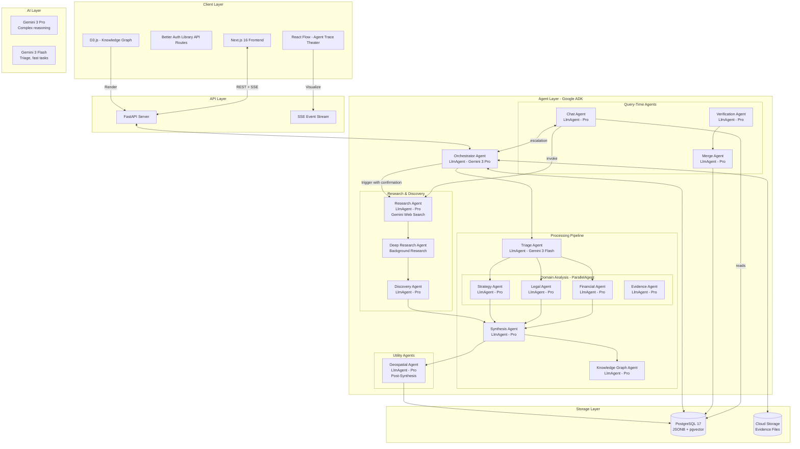

### Component Boundaries

| Component | Responsibility | Communicates With | Technology |
|-----------|---------------|-------------------|------------|
| **Frontend** | UI rendering, SSE consumption, state management | FastAPI (REST+SSE) | Next.js 16, React Flow, D3.js, Zustand |
| **FastAPI Server** | REST endpoints, SSE streaming, job orchestration | ADK Runner, PostgreSQL, GCS | Python FastAPI, async |
| **ADK Runner** | Agent execution, session management, event streaming | All Agents, Session Service | Google ADK |
| **Orchestrator** | Pipeline control, file routing, agent spawning | Triage, Domain Agents, Synthesis | LlmAgent - Gemini 3 Pro |
| **Triage Agent** | Quick classification, domain scoring | Orchestrator (output_key) | LlmAgent - Gemini 3 Flash |
| **Domain Agents** | Deep multimodal analysis per domain (Financial, Legal, Strategy) | Synthesis (output_key) | LlmAgent - Gemini 3 Pro |
| **Evidence Agent** | Forensic authenticity analysis, chain of custody, corroboration | Synthesis (output_key) | LlmAgent - Gemini 3 Pro (high thinking, high media resolution) |
| **Synthesis Agent** | Cross-modal linking, contradictions, gaps | KG Agent (output_key) | LlmAgent - Gemini 3 Pro |
| **KG Agent** | Entity resolution, graph construction | PostgreSQL | LlmAgent - Gemini 3 Pro |
| **Chat Agent** | Knowledge-first Q&A, escalation | PostgreSQL, Orchestrator | LlmAgent - Gemini 3 Pro |
| **Verification Agent** | Validates user corrections | Source files, Merge Agent | LlmAgent - Gemini 3 Pro |
| **Merge Agent** | Incremental KG updates, conflict detection | PostgreSQL | LlmAgent - Gemini 3 Pro |
| **Research Agent** | External source discovery via Gemini web search | Discovery Agent, Orchestrator | LlmAgent - Gemini 3 Pro |
| **Discovery Agent** | Synthesizes external research into case context | Synthesis Agent (output_key) | LlmAgent - Gemini 3 Pro |
| **Geospatial Agent** | Location intelligence, movement patterns, Earth Engine | PostgreSQL, Evidence Agent | LlmAgent - Gemini 3 Pro (post-synthesis) |
| **PostgreSQL** | All persistent data, session state | All services | Cloud SQL PostgreSQL 17 |
| **Cloud Storage** | Evidence files, artifacts | FastAPI, Domain Agents | GCS |

---

## ADK Configuration & Limitations

### Known ADK Limitations and Mitigations

| Limitation | Impact | Mitigation |
|------------|--------|------------|
| **Tool confirmation only with InMemorySessionService** | Cannot use `require_confirmation` with DatabaseSessionService | Implement confirmation dialogs in frontend; track pending confirmations in Zustand |
| **Cannot use tools + output_schema together** | Synthesis Agent needs both tools and structured output | Split into two agents: tool-using agent → schema-constrained agent |
| **Single parent rule** | Agent can only be sub-agent of one parent | Agent factory pattern creates fresh instances per workflow |
| **State updates commit after Event yield** | Potential race conditions if not careful | Ensure tool results returned before yielding next event; use unique output_keys |
| **Temperature must stay at 1.0** | Lower values cause response looping in Gemini 3 | Never override temperature setting |
| **LoopAgent needs explicit escalate=True** | Loop runs until max_iterations without explicit exit | Add QualityThresholdChecker BaseAgent that yields `EventActions(escalate=True)` |
| **Thought signatures required for function calling** | Manual history manipulation can break multi-turn | Let SDK handle automatically; preserve entire response metadata in storage |

### State Scope Prefixes

ADK provides four state scope levels for different persistence needs:

| Prefix | Scope | Persistence | Holmes Use Case |
|--------|-------|-------------|-----------------|
| (none) | Current session | Yes (with DatabaseSessionService) | Case-specific data: findings, triage results |
| `user:` | All user sessions | Yes | Investigator preferences, custom rules, display settings |
| `app:` | Global application | Yes | System configuration, model versions, feature flags |
| `temp:` | Current invocation only | Never | Intermediate processing, scratch calculations |

**Usage Example:**
```python
# Case-specific (persists for this session/case)
ctx.session.state["triage_results"] = {...}

# User preference (persists across all user's cases)
ctx.session.state["user:default_view"] = "knowledge_graph"

# Application global
ctx.session.state["app:model_version"] = "gemini-3-pro-preview"

# Temporary (discarded after this invocation)
ctx.session.state["temp:intermediate_score"] = 0.75
```

### Thinking Mode Configuration

Each agent type requires appropriate thinking configuration:

```python
from google.genai import types

# Configuration per agent type
AGENT_THINKING_CONFIGS = {
    "triage": types.GenerateContentConfig(
        thinking_config=types.ThinkingConfig(
            thinking_level="low",      # Speed priority
            include_thoughts=True      # Still capture for transparency
        )
    ),
    "orchestrator": types.GenerateContentConfig(
        thinking_config=types.ThinkingConfig(
            thinking_level="high",     # Complex routing decisions
            include_thoughts=True
        )
    ),
    "financial": types.GenerateContentConfig(
        thinking_config=types.ThinkingConfig(
            thinking_level="medium",   # Balanced analysis
            include_thoughts=True
        ),
        generation_config={"media_resolution": "high"}  # Dense documents
    ),
    "legal": types.GenerateContentConfig(
        thinking_config=types.ThinkingConfig(
            thinking_level="high",     # Nuanced interpretation
            include_thoughts=True
        ),
        generation_config={"media_resolution": "high"}
    ),
    "strategy": types.GenerateContentConfig(
        thinking_config=types.ThinkingConfig(
            thinking_level="medium",
            include_thoughts=True
        )
    ),
    "evidence": types.GenerateContentConfig(
        thinking_config=types.ThinkingConfig(
            thinking_level="high",     # Forensic-level analysis
            include_thoughts=True
        ),
        generation_config={"media_resolution": "high"}  # Critical for authenticity
    ),
    "synthesis": types.GenerateContentConfig(
        thinking_config=types.ThinkingConfig(
            thinking_level="high",
            include_thoughts=True
        )
    ),
    "chat": types.GenerateContentConfig(
        thinking_config=types.ThinkingConfig(
            thinking_level="medium",   # Responsive Q&A
            include_thoughts=True
        )
    ),
    "verification": types.GenerateContentConfig(
        thinking_config=types.ThinkingConfig(
            thinking_level="high",     # Critical accuracy
            include_thoughts=True
        )
    ),
    "research": types.GenerateContentConfig(
        thinking_config=types.ThinkingConfig(
            thinking_level="medium",   # Source discovery
            include_thoughts=True
        )
    ),
    "discovery": types.GenerateContentConfig(
        thinking_config=types.ThinkingConfig(
            thinking_level="medium",   # External synthesis
            include_thoughts=True
        )
    ),
    "geospatial": types.GenerateContentConfig(
        thinking_config=types.ThinkingConfig(
            thinking_level="medium",   # Location analysis
            include_thoughts=True
        )
    ),
}
```

### Video/Audio Processing with Metadata

For precise segment analysis in video and audio evidence:

```python
from google.genai.types import VideoMetadata

# Process specific video segment (e.g., deposition from 15:00 to 45:00)
video_file = client.files.upload(file="deposition.mp4")

response = client.models.generate_content(
    model="gemini-3-pro-preview",
    contents=[
        types.Part(
            file_data=types.FileData(file_uri=video_file.uri),
            video_metadata=VideoMetadata(
                start_offset="00:15:00",
                end_offset="00:45:00"
            )
        ),
        """Analyze this deposition segment:
        1. Identify speaker and their demeanor
        2. Extract key statements with timestamps
        3. Note any hesitations, contradictions, or emotional cues
        4. Cross-reference with case context"""
    ],
    config=AGENT_THINKING_CONFIGS["evidence"]
)

# Audio with speaker diarization
audio_file = client.files.upload(file="phone_call.mp3")

response = client.models.generate_content(
    model="gemini-3-pro-preview",
    contents=[
        audio_file,
        """Process this audio recording:
        1. Transcribe with speaker identification (Speaker 1, Speaker 2...)
        2. Include timestamps (MM:SS) for each speaker turn
        3. Note emotional tone and any stress indicators
        4. Flag any admissions or contradictory statements"""
    ],
    config=AGENT_THINKING_CONFIGS["evidence"]
)
```

### Artifact Service Configuration

Use ADK's GcsArtifactService for versioned evidence and report storage:

```python
from google.adk.artifacts import GcsArtifactService
from google.adk.runners import Runner
from google.genai import types

# Configure artifact service
artifact_service = GcsArtifactService(bucket_name="holmes-evidence-bucket")

# Runner with artifact service
runner = Runner(
    agent=root_agent,
    app_name="holmes",
    session_service=session_service,
    artifact_service=artifact_service
)

# In a tool - save generated report with versioning
async def generate_report(case_id: str, findings: dict, tool_context: ToolContext) -> dict:
    # Generate PDF report
    pdf_content = create_pdf_report(findings)
    pdf_artifact = types.Part.from_bytes(
        data=pdf_content,
        mime_type="application/pdf"
    )

    # Save with automatic versioning
    version = await tool_context.save_artifact(
        filename=f"cases/{case_id}/reports/investigation_report.pdf",
        artifact=pdf_artifact
    )

    # Save structured findings as JSON
    json_artifact = types.Part.from_bytes(
        data=json.dumps(findings).encode(),
        mime_type="application/json"
    )
    findings_version = await tool_context.save_artifact(
        filename=f"cases/{case_id}/findings/structured_findings.json",
        artifact=json_artifact
    )

    # Store references in state for downstream access
    tool_context.state[f"case:{case_id}:report_version"] = version
    tool_context.state[f"case:{case_id}:findings_version"] = findings_version

    return {
        "report_stored": True,
        "report_version": version,
        "findings_version": findings_version,
        "artifact_path": f"cases/{case_id}/reports/investigation_report.pdf"
    }

# In a tool - load artifact
async def load_previous_report(case_id: str, tool_context: ToolContext) -> dict:
    artifact = tool_context.load_artifact(
        f"cases/{case_id}/reports/investigation_report.pdf"
    )
    if artifact and artifact.inline_data:
        return {"found": True, "data": artifact.inline_data.data}
    return {"found": False}
```

### Context Caching for Cost Optimization

Implement context caching for Chat Agent sessions (4x cost reduction):

```python
from google import genai

client = genai.Client()

async def create_case_evidence_cache(case_id: str, evidence_files: list[str]) -> str:
    """Create context cache when user opens case for chat."""

    # Upload all case evidence files
    uploaded_files = [
        client.files.upload(file=filepath)
        for filepath in evidence_files
    ]

    # Create cache with 2-hour TTL (typical session duration)
    cache = client.caches.create(
        model="gemini-3-pro-preview",
        contents=uploaded_files,
        ttl="7200s"  # 2 hours
    )

    return cache.name

async def chat_with_cached_evidence(
    cache_name: str,
    user_query: str
) -> str:
    """Query against cached evidence (4x cheaper)."""

    response = client.models.generate_content(
        model="gemini-3-pro-preview",
        contents=user_query,
        cached_content=cache_name,  # Use cached evidence
        config=AGENT_THINKING_CONFIGS["chat"]
    )

    return response.text

# Invalidate cache when new evidence added
async def invalidate_cache_on_new_evidence(case_id: str):
    """Called when new evidence uploaded to case."""
    # Delete existing cache
    # Recreate with new evidence set
    pass
```

### Context Compaction for Long Investigations

Prevent context window exhaustion in complex, multi-session investigations:

```python
from google.adk.apps.app import App, EventsCompactionConfig
from google.adk.apps.llm_event_summarizer import LlmEventSummarizer
from google.adk.models import Gemini

# Configure compaction for long investigations
app = App(
    name='holmes-investigation',
    root_agent=investigation_agent,
    events_compaction_config=EventsCompactionConfig(
        compaction_interval=5,  # Summarize every 5 invocations
        overlap_size=2,         # Keep 2 recent events in full
        summarizer=LlmEventSummarizer(
            llm=Gemini(model="gemini-3-flash-preview")  # Flash for cost
        )
    )
)
```

### Resilient Agent Wrapper Pattern

Graceful degradation with fallback agents:

```python
from google.adk.agents import LlmAgent, BaseAgent
from google.adk.events import Event, EventActions
from google.genai import types
from typing import AsyncGenerator
import logging

logger = logging.getLogger("holmes")

class ResilientAgentWrapper(BaseAgent):
    """Wraps an agent with error handling and fallback capability."""

    def __init__(
        self,
        name: str,
        primary_agent: LlmAgent,
        fallback_agent: LlmAgent = None,
        **kwargs
    ):
        super().__init__(name=name, **kwargs)
        self.primary_agent = primary_agent
        self.fallback_agent = fallback_agent

    async def _run_async_impl(self, ctx) -> AsyncGenerator[Event, None]:
        try:
            async for event in self.primary_agent._run_async_impl(ctx):
                yield event
        except Exception as e:
            logger.error(f"Primary agent {self.primary_agent.name} failed: {e}")

            # Record failure in state for debugging
            ctx.session.state[f"error:{self.primary_agent.name}"] = str(e)

            if self.fallback_agent:
                logger.info(f"Falling back to {self.fallback_agent.name}")
                try:
                    async for event in self.fallback_agent._run_async_impl(ctx):
                        yield event
                except Exception as fallback_error:
                    logger.error(f"Fallback also failed: {fallback_error}")
                    yield self._create_error_event(e, fallback_error)
            else:
                yield self._create_error_event(e)

    def _create_error_event(self, primary_error, fallback_error=None) -> Event:
        """Create graceful error message."""
        if fallback_error:
            msg = f"Analysis unavailable. Primary: {primary_error}. Fallback: {fallback_error}"
        else:
            msg = f"Analysis partially unavailable. Error: {primary_error}. Proceeding with available data."

        return Event(
            author=self.name,
            content=types.Content(
                role="model",
                parts=[types.Part(text=msg)]
            )
        )

# Usage - wrap each domain agent
resilient_financial = ResilientAgentWrapper(
    name="ResilientFinancialAgent",
    primary_agent=LlmAgent(
        name="FinancialAgent",
        model="gemini-3-pro-preview",
        generate_content_config=AGENT_THINKING_CONFIGS["financial"]
    ),
    fallback_agent=LlmAgent(
        name="FinancialAgentFallback",
        model="gemini-3-flash-preview",  # Faster, cheaper fallback
        instruction="Provide basic financial analysis (degraded mode)..."
    )
)
```

### Deep Research Agent Integration

For autonomous background research on case subjects:

```python
from google import genai

client = genai.Client()

async def start_background_research(subject: str, case_context: str) -> str:
    """Start autonomous deep research on a subject."""

    research_query = f"""
    Research all publicly available information about {subject}:

    1. Corporate filings and business registrations
    2. News articles and press coverage
    3. Legal records and court filings
    4. Professional history and associations
    5. Public financial disclosures

    Case context for relevance filtering:
    {case_context}

    Focus on information relevant to potential fraud investigation.
    """

    # Start background research (runs autonomously)
    interaction = client.interactions.create(
        input=research_query,
        agent='deep-research-pro-preview-12-2025',
        background=True,  # Required for Deep Research
        stream=True,
        agent_config={
            "type": "deep-research",
            "thinking_summaries": "auto"  # Get progress updates
        }
    )

    return interaction.id

async def stream_research_progress(interaction_id: str):
    """Stream research progress to frontend."""

    stream = client.interactions.get_stream(interaction_id)

    async for chunk in stream:
        if chunk.delta.type == "thought_summary":
            yield {
                "type": "research_progress",
                "summary": chunk.delta.content.text
            }
        elif chunk.delta.type == "text":
            yield {
                "type": "research_finding",
                "text": chunk.delta.text
            }
        elif chunk.status == "completed":
            yield {
                "type": "research_complete",
                "full_report": chunk.output
            }
```

---

## Agent Architecture Patterns

### Pattern 1: Hierarchical Orchestration

The Orchestrator is an intelligent LlmAgent (not a dumb router) that uses Gemini 3 Pro to make routing decisions based on triage results.

**What:** Central coordinator analyzes requests and dynamically routes to specialists
**When:** Complex workflows requiring adaptive task decomposition
**Why for Holmes:** Each case has different evidence composition; routing must be intelligent

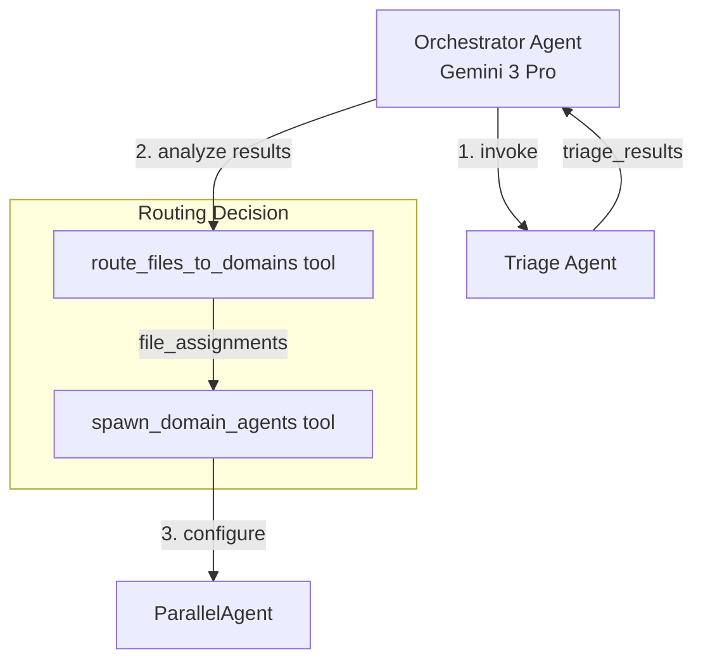

**ADK Implementation:**
```python
orchestrator = LlmAgent(
    name="Orchestrator",
    model="gemini-3-pro-preview",
    instruction="""You coordinate the investigation pipeline.
    1. Invoke Triage Agent on uploaded files
    2. Analyze triage_results to determine file→domain assignments
    3. Use route_files_to_domains tool to assign files where domain_score >= 0.4
    4. Spawn domain agents with appropriate configuration
    5. Trigger Synthesis and KG phases after domain analysis""",
    tools=[route_files_to_domains, spawn_domain_agents],
    sub_agents=[triage_agent, parallel_domain_agent, synthesis_agent, kg_agent],
    generate_content_config=GenerateContentConfig(
        thinking_config=ThinkingConfig(thinking_level="medium", include_thoughts=True)
    )
)
```

### Orchestrator Routing & Spawning Logic (Implementation Detail)

The Orchestrator Agent executes this logic after receiving triage results:

```
FUNCTION orchestrator_route_and_spawn(triage_results, case_context):
    // Step 1: Route files to domains based on domain_scores
    file_assignments = {}
    FOR each file IN triage_results.files:
        FOR each domain IN ["financial", "legal", "strategy", "evidence"]:
            IF file.domain_scores[domain] >= 0.4:  // Threshold for assignment
                file_assignments[domain].append(file.file_id)

    // Step 2: Calculate complexity per domain
    domain_complexity = {}
    FOR each domain IN file_assignments:
        domain_complexity[domain] = SUM(
            file.complexity_score FOR file IN domain_files
        )

    // Step 3: Determine agent configuration per domain
    domain_config = {}
    FOR each domain IN domain_complexity:
        IF domain_complexity[domain] < 2.0:
            domain_config[domain] = {type: "single", workers: 1}
        ELSE:
            worker_count = CEIL(domain_complexity[domain] / 1.5)
            domain_config[domain] = {
                type: "parallel_with_synthesis",
                workers: worker_count
            }

    // Step 4: Write to state for downstream agents
    state["file_assignments"] = file_assignments
    state["domain_config"] = domain_config

    // Step 5: Spawn ParallelAgent with configured domain agents
    RETURN build_parallel_agent(domain_config, file_assignments)
```

**Domain Agent Spawning Detail:**
```
FUNCTION build_domain_agent(domain, config, assigned_files):
    IF config.type == "single":
        RETURN LlmAgent(
            name=f"{domain}_agent",
            instruction=DOMAIN_PROMPTS[domain].format(files=assigned_files),
            output_key=f"{domain}_findings"
        )
    ELSE:  // parallel_with_synthesis
        workers = [
            LlmAgent(f"{domain}_worker_{i}", files=chunk)
            FOR i, chunk IN enumerate(split_files(assigned_files, config.workers))
        ]
        RETURN SequentialAgent([
            ParallelAgent(workers),
            LlmAgent(f"{domain}_synthesis", output_key=f"{domain}_findings")
        ])
```

**Note:** A file can be assigned to multiple domains if it has high scores (≥0.4) in multiple areas.

### Pattern 2: Parallel Fan-Out / Gather

Domain agents run concurrently for maximum throughput, with outputs gathered via session state.

**What:** Multiple agents execute simultaneously, results aggregated afterward
**When:** Independent analyses that benefit from parallelization
**Why for Holmes:** Financial, Legal, Strategy, and Evidence analysis are independent; parallelism reduces total time

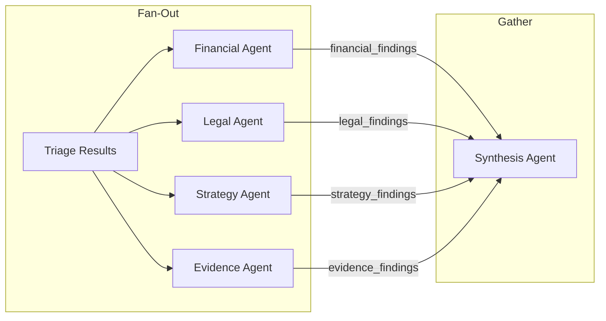

**ADK Implementation:**
```python
parallel_domain_analysis = ParallelAgent(
    name="DomainAnalysis",
    sub_agents=[
        LlmAgent(
            name="FinancialAgent",
            instruction="Analyze financial evidence: {file_assignments.financial}",
            output_key="financial_findings"
        ),
        LlmAgent(
            name="LegalAgent",
            instruction="Analyze legal evidence: {file_assignments.legal}",
            output_key="legal_findings"
        ),
        LlmAgent(
            name="StrategyAgent",
            instruction="Analyze strategy evidence: {file_assignments.strategy}",
            output_key="strategy_findings"
        ),
        LlmAgent(
            name="EvidenceAgent",
            instruction="Evaluate evidence quality and authenticity: {file_assignments.evidence}",
            output_key="evidence_findings"
        )
    ]
)
```

**Critical:** Each sub-agent must use a unique `output_key` to prevent race conditions in shared session state.

### Pattern 3: Sequential Pipeline

Processing phases execute in strict order where each phase depends on the previous.

**What:** Ordered execution where output of phase N becomes input of phase N+1
**When:** Clear dependencies between processing stages
**Why for Holmes:** Triage → Domain → Synthesis → KG is a natural dependency chain

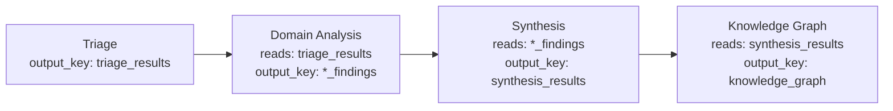

**ADK Implementation:**
```python
processing_pipeline = SequentialAgent(
    name="ProcessingPipeline",
    sub_agents=[
        triage_agent,           # output_key="triage_results"
        parallel_domain_agent,  # output_key="*_findings"
        synthesis_agent,        # output_key="synthesis_results"
        kg_agent               # output_key="knowledge_graph"
    ]
)
```

### Pattern 4: Generator-Critic (for Synthesis Quality)

Synthesis outputs are evaluated and refined until quality threshold met.

**What:** One agent generates, another critiques, loop until satisfactory
**When:** Output quality critical and single-pass insufficient
**Why for Holmes:** Contradiction detection and gap analysis require high confidence

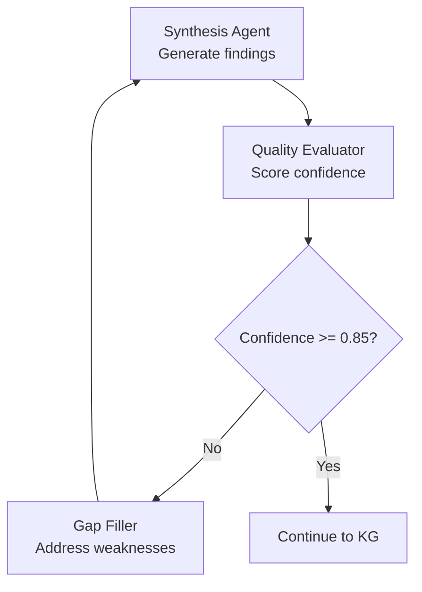

**ADK Implementation:**
```python
class QualityThresholdChecker(BaseAgent):
    async def _run_async_impl(self, ctx):
        assessment = ctx.session.state.get("quality_assessment", {})
        confidence = assessment.get("confidence", "low")
        should_stop = (confidence == "high")
        yield Event(
            author=self.name,
            actions=EventActions(escalate=should_stop)
        )

quality_loop = LoopAgent(
    name="SynthesisQualityLoop",
    max_iterations=3,
    sub_agents=[
        synthesis_agent,                    # Generator
        quality_evaluator,                  # Critic
        QualityThresholdChecker(name="ThresholdChecker"),
        gap_filler                          # Refiner
    ]
)
```

### Pattern 5: Knowledge-First with Escalation (Chat)

Chat Agent queries persisted knowledge first (fast), escalates to domain agents only for novel questions.

**What:** Two-tier response: cached knowledge → fresh analysis
**When:** Most queries answerable from existing data, expensive reanalysis rare
**Why for Holmes:** 80% of questions are about already-processed evidence

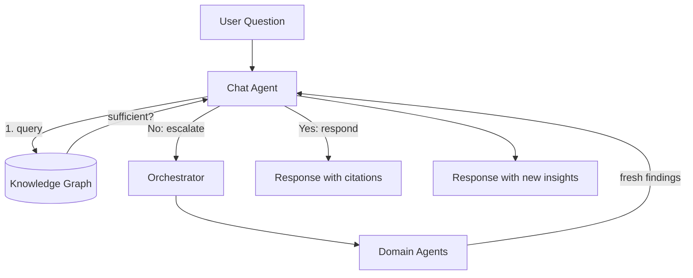

**ADK Implementation:**
```python
chat_agent = LlmAgent(
    name="ChatAgent",
    model="gemini-3-pro-preview",
    instruction="""Answer user questions about the case.
    1. First use query_knowledge_graph tool to check existing knowledge
    2. If sufficient, respond with inline citations
    3. If insufficient, use escalate_to_domain tool for fresh analysis
    4. Always cite sources using [Source: file_id, location] format""",
    tools=[query_knowledge_graph, search_findings, get_source_context, escalate_to_domain],
    generate_content_config=GenerateContentConfig(
        thinking_config=ThinkingConfig(thinking_level="medium", include_thoughts=True)
    )
)
```

---

## Data Flow

### Processing Pipeline Data Flow

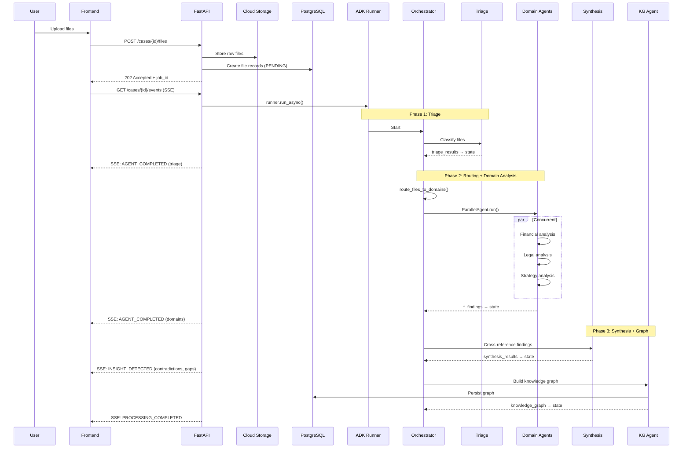

### State Flow Between Agents

| Step | Agent | Reads from State | Writes to State | Purpose |
|------|-------|------------------|-----------------|---------|
| 1 | Triage | `uploaded_files` | `triage_results` | Per-file domain scores, complexity |
| 2 | Orchestrator | `triage_results` | `file_assignments`, `domain_config` | Route files, determine worker count |
| 3a | Financial | `file_assignments.financial` | `financial_findings` | Financial evidence analysis |
| 3b | Legal | `file_assignments.legal` | `legal_findings` | Legal evidence analysis |
| 3c | Strategy | `file_assignments.strategy` | `strategy_findings` | Strategic evidence analysis |
| 3d | Evidence | `file_assignments.evidence` | `evidence_findings` | Evidence quality, authenticity |
| 4 | Synthesis | `*_findings` | `synthesis_results` | Cross-modal links, contradictions, gaps |
| 5 | KG Agent | `synthesis_results` | `knowledge_graph` | Entity resolution, graph structure |
| 6 | Chat | `knowledge_graph`, `*_findings` | `chat_response` | Query answering |
| 7 | Verification | `correction_request` | `verification_result` | Validate corrections |
| 8 | Merge | `new_findings`, `knowledge_graph` | `merge_plan` | Incremental updates |
| 9 | Research | `research_query` | `source_map` | External source discovery |
| 10 | Discovery | `source_map` | `discovery_findings` | Synthesize external research |
| 11 | Geospatial | `synthesis_results` | `locations`, `movement_patterns` | Location intelligence |
| - | All Domain Agents | `hypotheses` | `hypothesis_evaluations`, `new_hypotheses` | Hypothesis evaluation |
| - | Synthesis | `*_findings`, `hypotheses` | `investigation_tasks` | Task generation |

### Real-Time Event Flow (SSE)

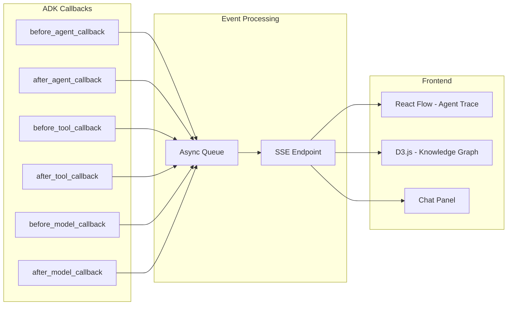

**ADK Callback to SSE Event Mapping:**

```python
from google.adk.agents.callback_context import CallbackContext
from google.adk.models import LlmResponse, LlmRequest
import asyncio
import time

# Global event queue for SSE streaming
visualization_queue = asyncio.Queue()

def before_agent_callback(callback_context: CallbackContext):
    """Emit AGENT_SPAWNED when agent starts."""
    asyncio.create_task(visualization_queue.put({
        "type": "AGENT_SPAWNED",
        "node_id": callback_context.invocation_id,
        "agent": callback_context.agent_name,
        "timestamp": time.time(),
        "state_keys": list(callback_context.state.keys())
    }))
    return None  # Continue normal execution

def after_agent_callback(callback_context: CallbackContext, response):
    """Emit AGENT_COMPLETED with result summary."""
    result_summary = None
    if response and hasattr(response, 'text'):
        result_summary = response.text[:500]  # Truncate for SSE

    asyncio.create_task(visualization_queue.put({
        "type": "AGENT_COMPLETED",
        "node_id": callback_context.invocation_id,
        "agent": callback_context.agent_name,
        "timestamp": time.time(),
        "result_summary": result_summary,
        "output_key": getattr(callback_context, 'output_key', None)
    }))
    return None

def before_tool_callback(tool, args, tool_context):
    """Emit TOOL_INVOKED when agent calls a tool."""
    asyncio.create_task(visualization_queue.put({
        "type": "TOOL_INVOKED",
        "parent_node": tool_context.function_call_event_id,
        "tool_name": tool.name,
        "args": {k: str(v)[:100] for k, v in args.items()},  # Truncate args
        "timestamp": time.time()
    }))
    return None

def after_tool_callback(tool, args, tool_context, result):
    """Emit TOOL_COMPLETED with result preview."""
    asyncio.create_task(visualization_queue.put({
        "type": "TOOL_COMPLETED",
        "parent_node": tool_context.function_call_event_id,
        "tool_name": tool.name,
        "result_preview": str(result)[:200],
        "timestamp": time.time()
    }))
    return None

def before_model_callback(
    callback_context: CallbackContext,
    llm_request: LlmRequest
) -> Optional[LlmResponse]:
    """Emit THINKING_UPDATE for transparency."""
    asyncio.create_task(visualization_queue.put({
        "type": "THINKING_UPDATE",
        "node_id": callback_context.invocation_id,
        "agent": callback_context.agent_name,
        "status": "reasoning",
        "timestamp": time.time()
    }))
    return None

def after_model_callback(
    callback_context: CallbackContext,
    llm_response: LlmResponse
) -> Optional[LlmResponse]:
    """Emit MODEL_RESPONSE with thinking traces if available."""
    thinking_traces = []
    response_text = None

    if llm_response and llm_response.candidates:
        for part in llm_response.candidates[0].content.parts:
            if hasattr(part, 'thought') and part.thought:
                thinking_traces.append(part.text)
            else:
                response_text = part.text

    asyncio.create_task(visualization_queue.put({
        "type": "MODEL_RESPONSE",
        "node_id": callback_context.invocation_id,
        "agent": callback_context.agent_name,
        "thinking_traces": thinking_traces,  # For Agent Trace Theater
        "response_preview": response_text[:300] if response_text else None,
        "timestamp": time.time()
    }))
    return None

# Apply callbacks to all agents
def create_agent_with_callbacks(agent_config: dict) -> LlmAgent:
    """Factory that adds visualization callbacks to any agent."""
    return LlmAgent(
        **agent_config,
        before_agent_callback=before_agent_callback,
        after_agent_callback=after_agent_callback,
        before_tool_callback=before_tool_callback,
        after_tool_callback=after_tool_callback,
        before_model_callback=before_model_callback,
        after_model_callback=after_model_callback
    )
```

**SSE Event Types:**
```typescript
type SSEEventType =
  | "PROCESSING_STARTED"
  | "AGENT_SPAWNED"      // New agent node in trace (from before_agent_callback)
  | "AGENT_PROGRESS"     // Partial update
  | "THINKING_UPDATE"    // Reasoning started (from before_model_callback)
  | "MODEL_RESPONSE"     // Thinking traces available (from after_model_callback)
  | "TOOL_INVOKED"       // Tool call started (from before_tool_callback)
  | "TOOL_COMPLETED"     // Tool call finished (from after_tool_callback)
  | "AGENT_COMPLETED"    // Agent finished (from after_agent_callback)
  | "INSIGHT_DETECTED"   // Contradiction/gap/link found
  | "GRAPH_UPDATED"      // KG changed
  | "CHAT_TOKEN"         // Streaming chat response
  | "CHAT_COMPLETE"      // Chat with citations
  | "CORRECTION_VERIFIED"
  | "CONFLICT_DETECTED"
  | "STALE_ITEMS_MARKED" // Items need regeneration after correction
  | "PROCESSING_COMPLETED"
  | "PROCESSING_FAILED"
  | "RESEARCH_PROGRESS"  // Deep Research agent progress
  | "RESEARCH_COMPLETE" // Deep Research finished
  | "RESEARCH_SUGGESTED"  // Orchestrator suggests research (user confirmation needed)
  | "HYPOTHESIS_CREATED"  // New hypothesis proposed
  | "HYPOTHESIS_UPDATED"  // Hypothesis status changed
  | "HYPOTHESIS_EVALUATED"  // Evidence linked to hypothesis
  | "TASK_CREATED"  // Investigation task generated
  | "TASK_UPDATED"  // Task status changed
  | "TASK_COMPLETED"  // Task marked complete
  | "LOCATION_EXTRACTED"  // Geospatial Agent found location
  | "MOVEMENT_DETECTED";  // Movement pattern identified

// Frontend event handler mapping
const SSE_TO_UI_HANDLERS = {
  AGENT_SPAWNED: (data) => addNodeToReactFlow(data),
  AGENT_COMPLETED: (data) => completeNodeInReactFlow(data),
  TOOL_INVOKED: (data) => showToolCallIndicator(data),
  THINKING_UPDATE: (data) => showThinkingSpinner(data),
  MODEL_RESPONSE: (data) => displayThinkingTraces(data),
  INSIGHT_DETECTED: (data) => highlightInsightInGraph(data),
  // ... etc
};
```

### Chat & Correction Flow

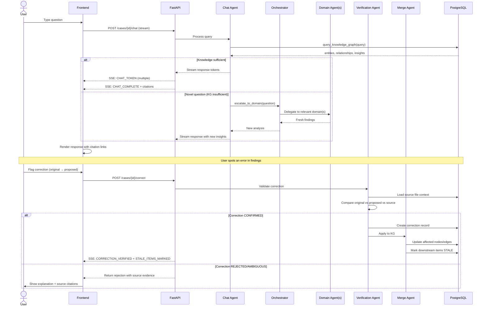

### Incremental File Addition Flow

When files are added to an existing case:

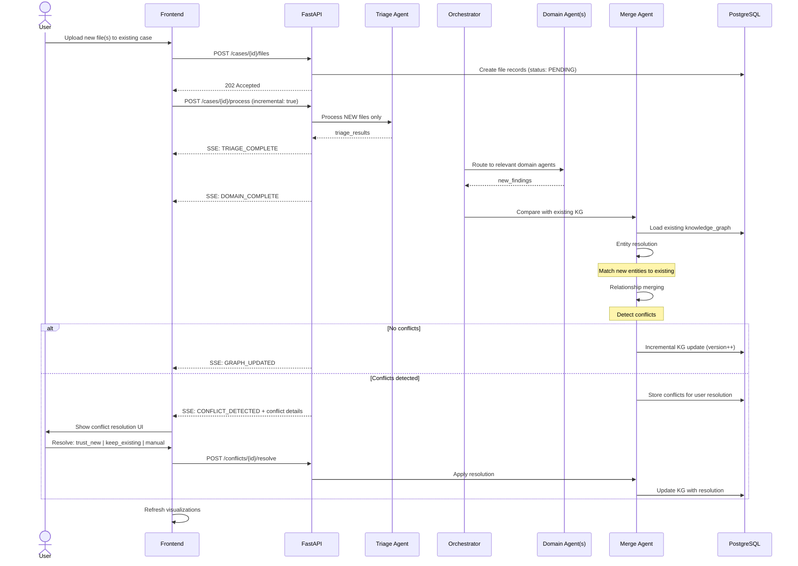

### Merge Conflict Resolution Flow

The Merge Agent handles incremental knowledge graph updates for both corrections and new file uploads:

**Responsibilities:**

1. **Entity Resolution**: Match new entities to existing graph nodes
   - Same entity, different mentions → merge with alias
   - Similar but distinct → keep separate, note similarity score

2. **Relationship Merging**: Combine edges from new findings
   - Compatible values → aggregate confidence
   - Conflicting values → **FLAG FOR USER** (never auto-resolve)

3. **Conflict Detection**: Surface contradictions between new and existing
   - Create `contradiction` record with both sources
   - User resolves via: Trust New | Keep Existing | Manual Merge

4. **Incremental Update**: Modify graph surgically
   - Update affected nodes/edges only
   - Mark dependents as STALE (user decides regeneration)

**Merge Plan Output Schema:**
```json
{
  "entities_to_merge": [{"new_id": "...", "existing_id": "...", "merge_confidence": 0.92}],
  "new_entities": [...],
  "relationships_to_add": [...],
  "conflicts": [{"type": "value_conflict", "existing_source": {...}, "new_source": {...}, "severity": "HIGH"}],
  "stale_items": ["item_id_1", "item_id_2"]
}
```

**Key Principle:** Conflicts are NEVER auto-resolved. User maintains control over case truth.

### Intermediate Persistence Strategy

To ensure robustness against failures, key intermediate results are persisted to PostgreSQL at phase boundaries:

| Phase Complete | Data Persisted | Table | Purpose |
|---------------|----------------|-------|--------|
| Triage | `triage_results` | `files.triage_metadata` | Resume from triage if domain agents fail |
| Domain Analysis | `*_findings` | `findings` (status: `interim`) | Preserve domain work if synthesis fails |
| Synthesis | `synthesis_results` | `findings` (status: `synthesized`) | Preserve cross-references if KG fails |
| Knowledge Graph | `knowledge_graph` | `knowledge_graphs` | Final output, enables chat |

**Recovery Flow:**
```
IF processing fails at Phase N:
  1. Load last successful phase output from PostgreSQL
  2. Resume from Phase N (not from beginning)
  3. Mark `processing_jobs.errors` with failure context
  4. Emit SSE: PARTIAL_COMPLETE with completed phases
```

---

## Anti-Patterns to Avoid

### Anti-Pattern 1: File-Type Based Agents

**What:** Separate agents for PDF, video, audio, image
**Why bad:** Wastes Gemini 3's native multimodal capability; artificial boundaries
**Instead:** Domain-based agents (Financial, Legal, Strategy) that handle ALL file types within their domain

### Anti-Pattern 2: Monolithic Single Agent

**What:** One mega-agent that does everything
**Why bad:** Undebuggable, no parallelism, unclear reasoning traces
**Instead:** Hierarchical multi-agent with clear responsibilities per agent

### Anti-Pattern 3: Synchronous Processing

**What:** Blocking REST calls for long-running analysis
**Why bad:** Timeouts, poor UX, no real-time feedback
**Instead:** Background jobs with SSE streaming for progress updates

### Anti-Pattern 4: Same output_key in ParallelAgent

**What:** Multiple parallel sub-agents writing to same state key
**Why bad:** Race conditions, data loss
**Instead:** Unique `output_key` per sub-agent; gather in synthesis phase

### Anti-Pattern 5: Tools with output_schema

**What:** Agent with both `tools` and `output_schema` configured
**Why bad:** ADK limitation - doesn't work
**Instead:** Split into two agents: tool-using agent → schema-constrained agent

### Anti-Pattern 6: Auto-Resolving Conflicts

**What:** Merge Agent automatically resolves contradictions
**Why bad:** Legal domain requires human judgment on truth
**Instead:** Surface conflicts to user; never auto-resolve

---

## Scalability Considerations

| Concern | At 10 cases | At 100 cases | At 1000 cases |
|---------|-------------|--------------|---------------|
| **Processing Time** | Single Cloud Run instance | Increase min instances | Multiple workers per domain |
| **Session Storage** | DatabaseSessionService | Same, add read replicas | Sharding by case_id |
| **Knowledge Graph** | PostgreSQL JSONB | Same | Consider Neo4j for complex queries |
| **File Storage** | Single GCS bucket | Same | Regional buckets for latency |
| **SSE Connections** | Direct from Cloud Run | Redis pub/sub | Dedicated SSE service |

### Migration Path (Post-Hackathon)

1. **Phase 1 (Hackathon):** In-process agents, single Cloud Run service
2. **Phase 2:** Agent Engine for managed sessions and scaling
3. **Phase 3:** A2A microservices for independent agent scaling
4. **Phase 4:** Neo4j for complex graph queries at scale

---

## Build Order (Dependency-Based)

Based on component dependencies, the recommended build order is:

### Layer 1: Foundation (No Dependencies)
```
1. PostgreSQL schema + migrations
2. Cloud Storage bucket setup
3. FastAPI skeleton with health check
4. Next.js skeleton with routing
```

### Layer 2: Core Infrastructure (Depends on Layer 1)
```
5. Authentication (Better Auth in Next.js)
6. File upload endpoint + GCS integration
7. SSE streaming infrastructure
8. ADK Runner factory with DatabaseSessionService
```

### Layer 3: Pipeline Agents (Depends on Layer 2)
```
9. Triage Agent (simplest agent, validates ADK setup)
10. Single Domain Agent (Financial, validates multimodal)
11. Remaining Domain Agents (Legal, Strategy, Evidence)
12. ParallelAgent wrapper for domains
```

### Layer 4: Intelligence Agents (Depends on Layer 3)
```
13. Synthesis Agent (cross-referencing logic)
14. Knowledge Graph Agent (entity resolution)
15. Orchestrator Agent (routing, spawning)
```

### Layer 5: Query-Time Agents (Depends on Layer 4)
```
16. Chat Agent (knowledge-first pattern)
17. Verification Agent (correction validation)
18. Merge Agent (incremental updates)
```

### Layer 6: Frontend Visualizations (Depends on Layer 4-5)
```
19. Agent Trace Theater (React Flow)
20. Knowledge Graph View (D3.js)
21. Source Panel (PDF, video, audio viewers)
22. Chat Panel with citations
```

### Layer 7: Polish (Depends on All)
```
23. Error handling + graceful degradation
24. Timeline view
25. Contradiction/gap panels
26. Incremental file addition flow
```

---

## Critical Architecture Decisions

| Decision | Rationale | Confidence |
|----------|-----------|------------|
| **Domain-based agents over file-type agents** | Gemini 3 is natively multimodal; artificial boundaries waste capability | HIGH |
| **PostgreSQL for everything** | DatabaseSessionService requires it; JSONB handles flexible schemas; single DB simplifies ops | HIGH |
| **SSE over WebSocket** | Unidirectional streaming sufficient for progress updates; simpler implementation | HIGH |
| **Orchestrator as LlmAgent** | Routing decisions require intelligence; dumb routers can't adapt to evidence composition | HIGH |
| **ParallelAgent for domains** | Financial, Legal, Strategy analysis are independent; parallelism reduces total time | HIGH |
| **output_key for state passing** | ADK's preferred mechanism; template substitution provides clean agent communication | HIGH |
| **LoopAgent for quality refinement** | Generator-critic pattern requires iteration; max_iterations prevents runaway costs | MEDIUM |
| **Chat escalation to Orchestrator** | Reuses existing routing logic; avoids duplicating domain selection | HIGH |
| **Evidence Agent as 4th domain** | Critical for legal authenticity verification; separate from financial/legal analysis | HIGH |

---

## User Journey Flow

### Complete User Journey

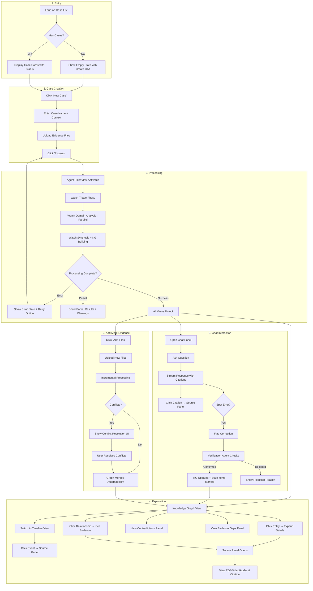

### View State Matrix

| Processing State | Agent Flow | Knowledge Graph | Timeline | Source Panel | Chat | Insights Panel |
|-----------------|------------|-----------------|----------|--------------|------|----------------|
| PENDING | Disabled | Disabled | Disabled | Disabled | Disabled | Disabled |
| PROCESSING | **Active** | Disabled | Disabled | Disabled | Disabled | Disabled |
| READY | Enabled | **Default** | Enabled | Enabled | **Enabled** | **Enabled** |
| PARTIAL | Enabled | Enabled (warnings) | Enabled | Enabled | Enabled | Enabled |
| ERROR | Enabled (shows errors) | Disabled | Disabled | Disabled | Disabled | Disabled |

---

## Deployment Architecture

### GCP Resource Layout

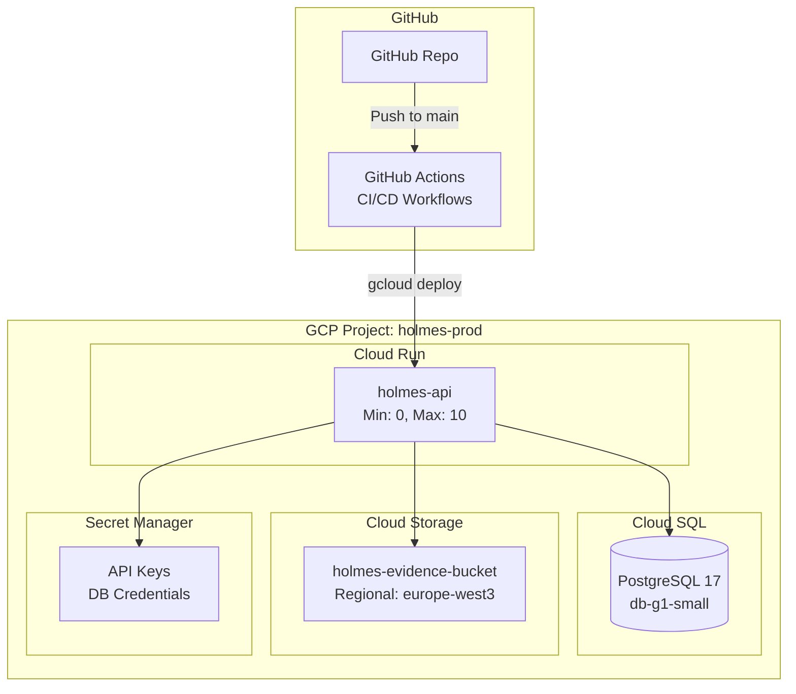

**Why GitHub Actions over Cloud Build:**
- Faster setup - no GCP API enabling or IAM role binding needed
- Better debugging - logs inline in GitHub PR/commit view
- Simpler iteration on workflow files
- Sufficient GCP integration via `google-github-actions/deploy-cloudrun`

### Deployment Workflow

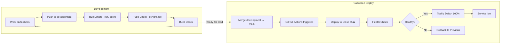

**Branching Strategy:**
- `development` - All feature work happens here, no CI gates
- `main` - Protected, merge triggers production deploy
- No feature branches or PR reviews required (hackathon mode)

### Environment Configuration

| Variable | Dev (Local) | Prod (Cloud Run) |
|----------|-------------|------------------|
| `DATABASE_URL` | `postgresql+asyncpg://localhost/holmes` | From Secret Manager |
| `GCS_BUCKET` | `holmes-dev-evidence` | `holmes-prod-evidence` |
| `GEMINI_API_KEY` | From .env | From Secret Manager |
| `ADK_SESSION_DB` | Same as DATABASE_URL | Same as DATABASE_URL |
| `ALLOWED_ORIGINS` | `localhost:3000` | `https://holmes.app` |
| `LOG_LEVEL` | `DEBUG` | `INFO` |

---

## Database Schema

### Entity Relationship Diagram

> **NOTE:** Auth Tables (user, session, account, verification) are managed by Better Auth (TypeScript). Python backend reads these tables but does not write to them.

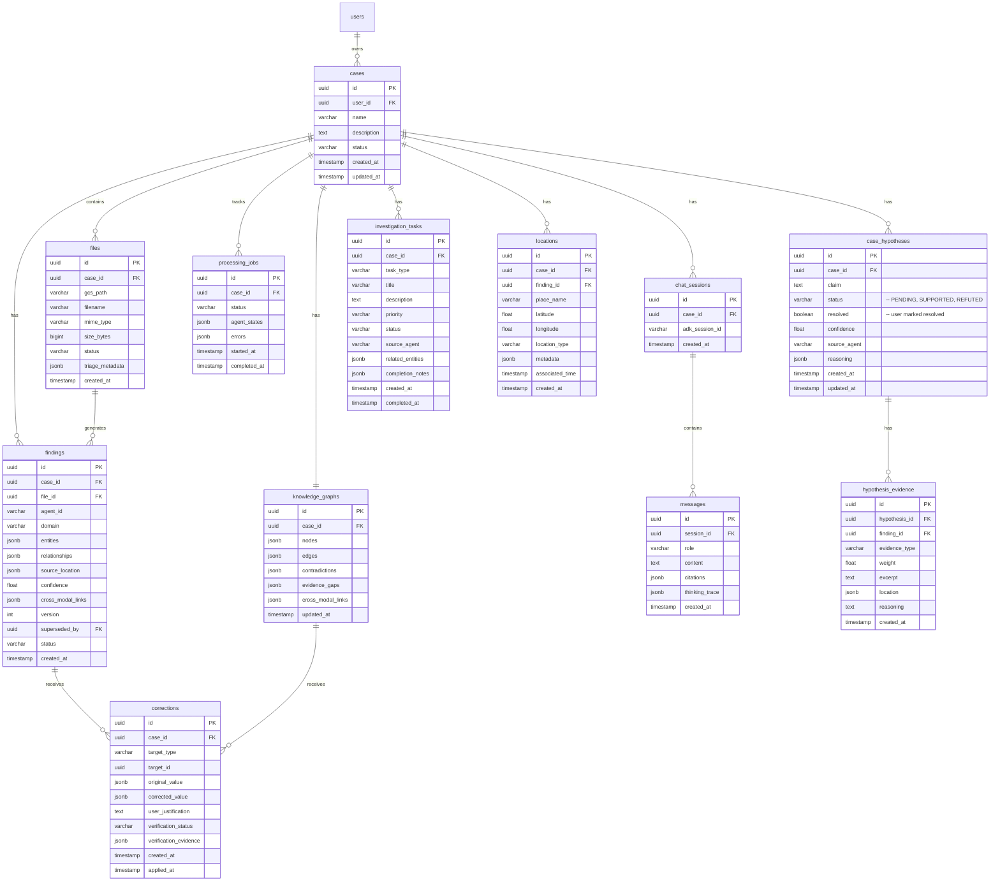

### Key JSONB Schemas

**files.triage_metadata:**
```json
{
  "classification": "Evidence|Legal/Statute|Legal/Precedent|Strategy/Playbook|Reference",
  "domain_scores": {"financial": 0.95, "legal": 0.40, "strategy": 0.20, "evidence": 0.85},
  "complexity_score": 0.72,
  "page_count": 156,
  "duration_seconds": null,
  "entities_preview": ["John Doe", "Shell Corp LLC"],
  "key_dates": ["2023-03-15", "2023-04-03"]
}
```

**knowledge_graphs.contradictions:**
```json
[
  {
    "id": "contradiction_001",
    "claim": "I was in New York on March 15th",
    "claim_source": {"file_id": "...", "timestamp": "14:32", "speaker": "John Doe"},
    "evidence_against": [
      {"file_id": "...", "description": "Video showing subject in LA at 02:34"},
      {"file_id": "...", "description": "Receipt in LA at 02:41"}
    ],
    "severity": "HIGH"
  }
]
```

**knowledge_graphs.evidence_gaps:**
```json
[
  {
    "element": "Destination of funds after Cayman transfer",
    "current_strength": "MISSING",
    "recommendation": "Subpoena Cayman Islands account records"
  }
]
```

**knowledge_graphs.cross_modal_links:**
```json
[
  {
    "source_a": {"file_id": "...", "type": "video", "timestamp": "02:34:17"},
    "source_b": {"file_id": "...", "type": "image", "location": "receipt timestamp"},
    "correlation_type": "TEMPORAL_PROXIMITY",
    "time_delta_seconds": 420,
    "implication": "Subject made purchase within 7 minutes of warehouse entry"
  }
]
```

---

## Sources

- [Google ADK Documentation - Multi-Agent Systems](https://google.github.io/adk-docs/agents/multi-agents/)
- [Google ADK Documentation - Agents](https://google.github.io/adk-docs/agents/)
- [Developer's Guide to Multi-Agent Patterns in ADK](https://developers.googleblog.com/developers-guide-to-multi-agent-patterns-in-adk/)
- [Google Cloud - Choose Design Pattern for Agentic AI](https://docs.cloud.google.com/architecture/choose-design-pattern-agentic-ai-system)
- [Azure Architecture Center - AI Agent Orchestration Patterns](https://learn.microsoft.com/en-us/azure/architecture/ai-ml/guide/ai-agent-design-patterns)
- [SSE for LLM Streaming (2025)](https://portalzine.de/sses-glorious-comeback-why-2025-is-the-year-of-server-sent-events/)
- [FastAPI SSE Streaming](https://blog.gopenai.com/how-to-stream-llm-responses-in-real-time-using-fastapi-and-sse-d2a5a30f2928)
- [Neo4j - Legal Documents to Knowledge Graphs](https://neo4j.com/blog/developer/from-legal-documents-to-knowledge-graphs/)
- [React Flow Documentation](https://reactflow.dev)
- [Event-Driven Architecture for Real-Time AI](https://launchcodex.com/blog/web-digital-infrastructure/event-driven-architectures-real-time-ai-processing/)
