# Holmes Legal Intelligence Platform - Technical PRD

## 1. Executive Summary

**Product**: Holmes - A legal/investigation intelligence platform that processes multimodal evidence files through domain-specialized AI agents utilising Gemini 3's multimodal capabilities, generating knowledge graphs, timeline visualizations, and enabling contextual chat with full agent decision transparency.

**Scope**: PoC for hackathon - Single user, ~10 cases, ~50 files per case (up to 500MB each), desktop-only.

**Core Differentiators**:

- Domain-based multi-agent orchestration
- Agent Flow - Full AI decision transparency with reasoning and agent heirarchy traces
- Multimodal evidence (documents, video, audio, images) linking, contradiction detection, and gap analysis
- Gemini 3's native multimodal processing within domain context

---

## 2. System Architecture Overview

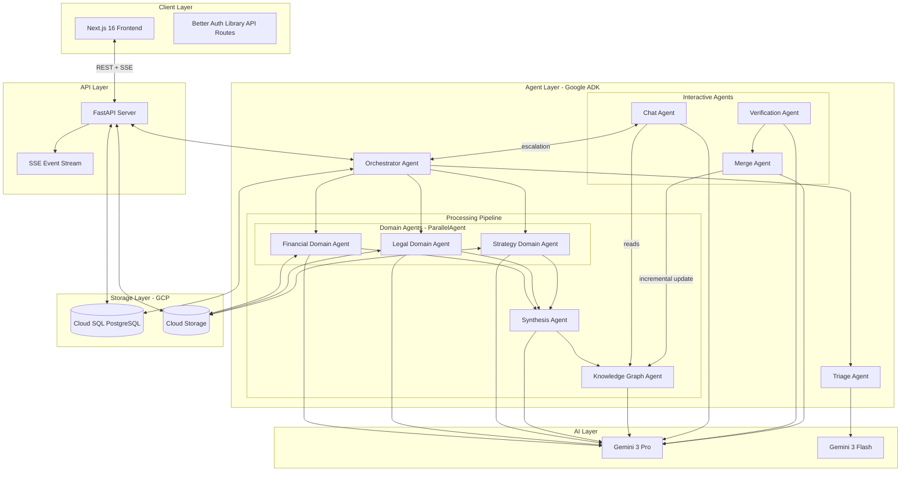

---

## 3. Data Flow Architecture

### 3.1 File Upload & Processing Flow

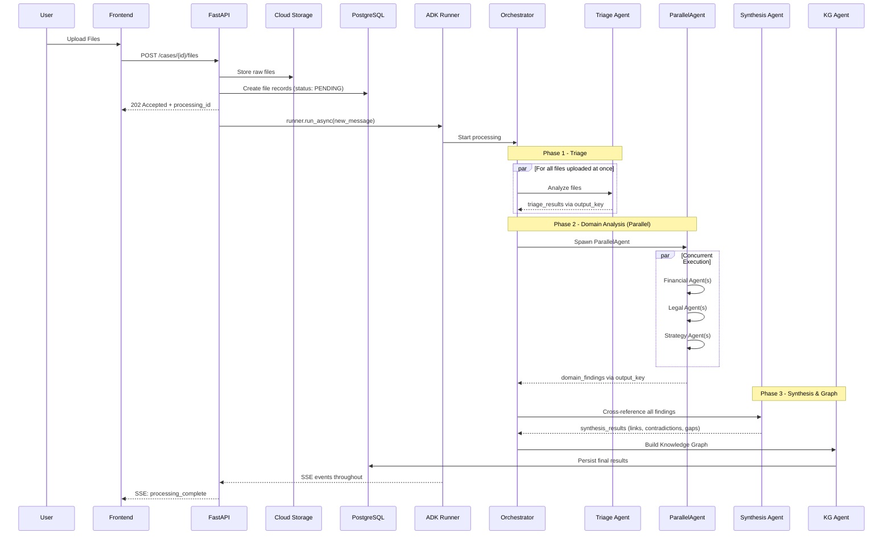

### 3.2 Real-Time Event Flow (SSE)

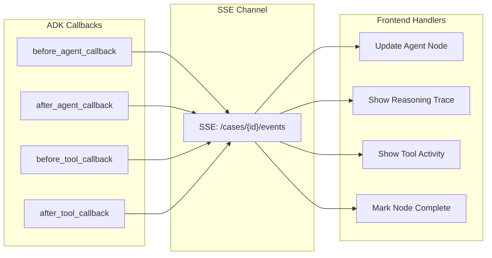

### 3.3 Chat & Correction Flow

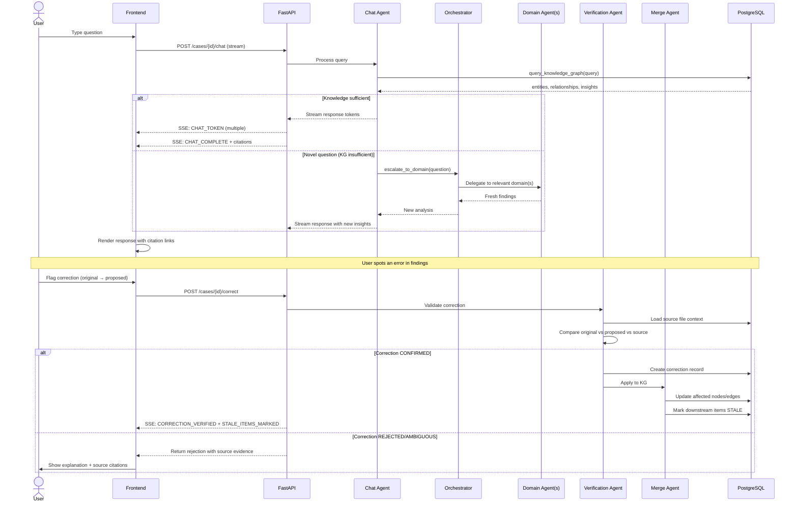

### 3.4 Incremental File Addition Flow

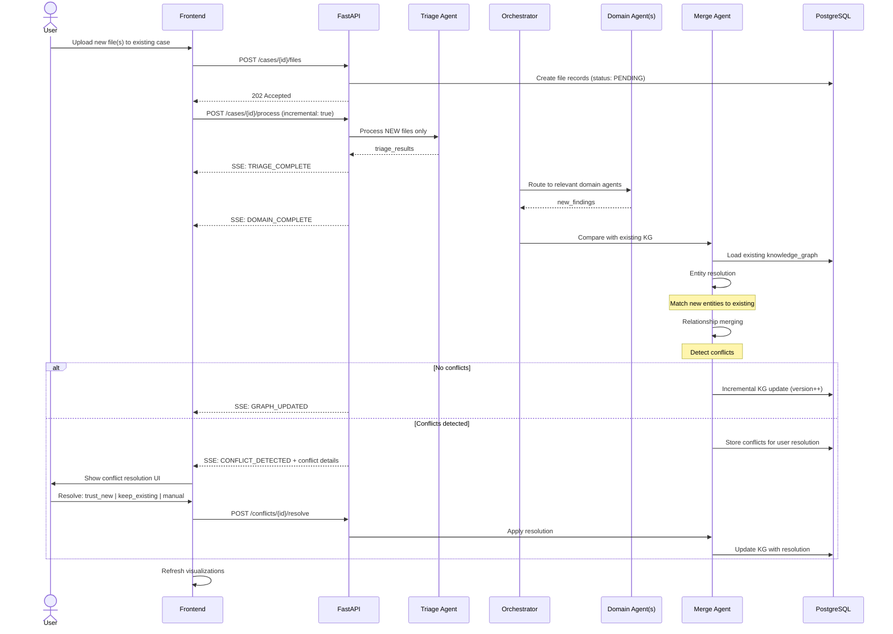

**SSE Event Schema**:

```typescript
interface SSEEvent {
  type: "AGENT_STARTED" | "AGENT_PROGRESS" | "TOOL_INVOKED" | 
        "THINKING_UPDATE" | "AGENT_COMPLETED" | "ERROR";
  agent_id: string;
  agent_type: "ORCHESTRATOR" | "TRIAGE" | "FINANCIAL" | "LEGAL" | 
              "STRATEGY" | "SYNTHESIS" | "KNOWLEDGE_GRAPH";
  timestamp: string;  // ISO8601
  payload: {
    thinking_summary?: string;  // From include_thoughts
    tool_name?: string;
    tool_args?: object;
    progress?: number;
    error?: string;
  };
}
```

---

## 4. Agentic System Architecture

### 4.1 ADK Agent Types Used

The system leverages ADK's specialized agent types for different orchestration patterns:

| ADK Agent Type | Usage in Holmes | Purpose |
|---------------|-----------------|---------|
| `LlmAgent` | Orchestrator, Triage, Domain workers, Synthesis, KG | LLM-powered analysis with tools |
| `SequentialAgent` | Inner pipeline (ParallelAgent → Synthesis → KG) | Ordered phase execution after routing |
| `ParallelAgent` | Domain analysis phase | Concurrent multi-domain processing |
| `LoopAgent` | Quality refinement (Post-PoC) | Iterative improvement until threshold |
| `BaseAgent` | Threshold checker (Post-PoC) | Custom escalation logic |

### 4.1.1 Orchestrator Agent - The Decision Maker

The **Orchestrator Agent** is an `LlmAgent` (not just a wrapper) that serves as the intelligent coordinator of the entire pipeline. It:

1. **Invokes Triage**: Delegates to the Triage Agent to quickly classify all uploaded files
2. **Analyzes Triage Results**: Reads `triage_results` containing per-file domain scores and complexity
3. **Routes Files to Domains**: Assigns each file to domain agent(s) based on `domain_scores` threshold (e.g., ≥0.4)
4. **Spawns Domain Configuration**: Determines worker count per domain based on cumulative complexity
5. **Assembles ParallelAgent**: Dynamically constructs the domain analysis phase with routed file assignments
6. **Triggers Downstream Phases**: After domain analysis, invokes Synthesis and KG agents sequentially

**Key Phases**:
- `route_files_to_domains`: Takes triage_results, returns file→domain assignments
- `spawn_domain_agents`: Creates domain agent configuration based on complexity
- `transfer_to_agent`: ADK built-in for delegating to sub-agents

### 4.2 Agent Pipeline Architecture

The Orchestrator Agent controls the entire flow, using tools and agent delegation to route files intelligently:

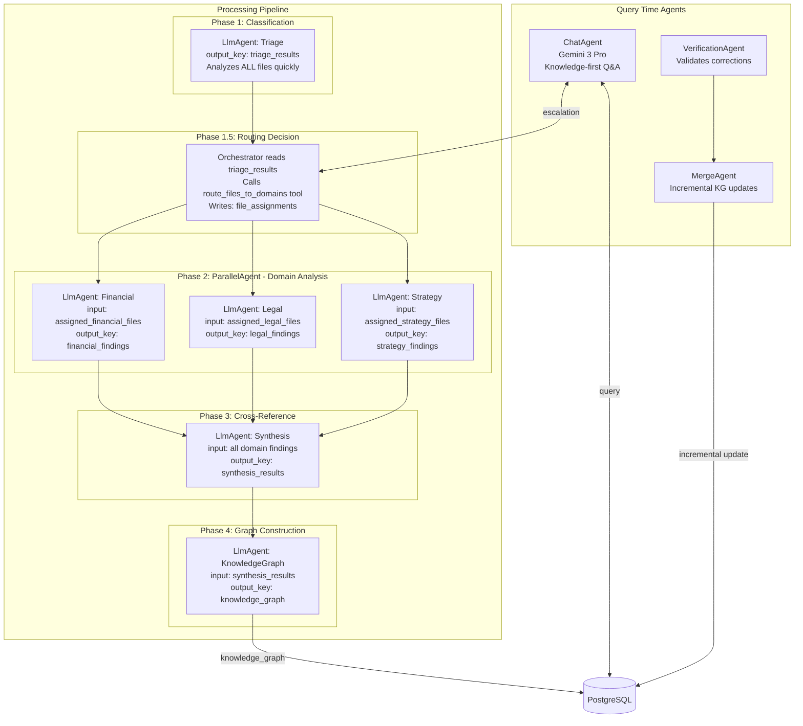

**Critical Distinction**: The Orchestrator is an intelligent `LlmAgent` that makes routing decisions. It uses Gemini to reason about triage results and dynamically configure the domain analysis phase.

### 4.3 State Communication Pattern

Agents communicate via ADK session state using `output_key` and template substitution:

```
Agent A (output_key="results_a") 
    → writes to state["results_a"]
    → Agent B instruction: "Analyze based on: {results_a}"
    → ADK auto-substitutes state value into prompt
```

**Complete State Flow with Routing**:

| Step | Agent | Reads from State | Writes to State | Purpose |
|------|-------|------------------|-----------------|--------|
| 1 | Triage | `uploaded_files` (file list) | `triage_results` | Per-file: domain_scores, complexity, metadata |
| 2 | Orchestrator | `triage_results` | `file_assignments`, `domain_config` | Routes files, determines worker counts |
| 3a | Financial Agent(s) | `file_assignments.financial` | `financial_findings` | Only processes assigned files |
| 3b | Legal Agent(s) | `file_assignments.legal` | `legal_findings` | Only processes assigned files |
| 3c | Strategy Agent(s) | `file_assignments.strategy` | `strategy_findings` | Only processes assigned files |
| 4 | Synthesis | `*_findings` (all domains) | `synthesis_results` | Cross-modal links, contradictions, gaps |
| 5 | Knowledge Graph | `synthesis_results` | `knowledge_graph` | Final graph structure |
| 6 | Orchestrator | `knowledge_graph` | Persists to PostgreSQL | Completes pipeline |
| 7 | Chat | `knowledge_graph`, `*_findings`, `case_context` | `chat_response`, `chat_history` | Answers user queries with citations |
| 8 | Verification | `correction_request`, source files | `verification_result` | Validates corrections against original sources |
| 9 | Merge | `new_findings`, `existing_knowledge_graph` | `merge_plan`, conflicts | Incremental graph updates for new files |

**Triage Results Schema** (drives routing):
```json
{
  "files": [
    {
      "file_id": "uuid",
      "filename": "bank_statements.pdf",
      "domain_scores": {"financial": 0.95, "legal": 0.15, "strategy": 0.10},
      "complexity_score": 0.72,
      "primary_domain": "financial",
      "secondary_domains": []
    },
    {
      "file_id": "uuid",
      "filename": "contract_amendment.pdf",
      "domain_scores": {"financial": 0.40, "legal": 0.85, "strategy": 0.30},
      "complexity_score": 0.55,
      "primary_domain": "legal",
      "secondary_domains": ["financial"]
    }
  ],
  "domain_complexity_totals": {"financial": 2.1, "legal": 1.8, "strategy": 0.6}
}
```

**File Assignments Schema** (written by Orchestrator):
```json
{
  "financial": ["file_id_1", "file_id_2"],
  "legal": ["file_id_2", "file_id_3"],
  "strategy": ["file_id_4"]
}
```
Note: A file can be assigned to multiple domains if it has high scores (≥0.4) in multiple areas.

### 4.3.1 Intermediate Persistence Strategy

To ensure robustness against failures, key intermediate results are persisted to PostgreSQL at phase boundaries:

| Phase Complete | Data Persisted | Table | Purpose |
|---------------|----------------|-------|--------|
| Triage | `triage_results` | `files.triage_metadata` | Resume from triage if domain agents fail |
| Domain Analysis | `*_findings` | `findings` (status: `interim`) | Preserve domain work if synthesis fails |
| Synthesis | `synthesis_results` | `findings` (status: `synthesized`) | Preserve cross-references if KG fails |
| Knowledge Graph | `knowledge_graph` | `knowledge_graphs` | Final output, enables chat |

**Recovery Flow**:
```
IF processing fails at Phase N:
  1. Load last successful phase output from PostgreSQL
  2. Resume from Phase N (not from beginning)
  3. Mark `processing_jobs.errors` with failure context
  4. Emit SSE: PARTIAL_COMPLETE with completed phases
```

### 4.4 Agent Definitions

| Agent | Model | Thinking Level | Role | Output Key |
|-------|-------|---------------|------|------------|
| **Orchestrator** | Gemini 3 Pro | `medium` | Pipeline control, file routing, agent spawning | `file_assignments`, `domain_config` |
| **Triage** | Gemini 3 Flash | `low` | Quick classification, domain scoring per file | `triage_results` |
| **Financial Domain** | Gemini 3 Pro | `high` | Financial pattern analysis on assigned files | `financial_findings` |
| **Legal Domain** | Gemini 3 Pro | `high` | Statute/precedent analysis on assigned files | `legal_findings` |
| **Strategy Domain** | Gemini 3 Pro | `high` | Tactical analysis on assigned files | `strategy_findings` |
| **Synthesis** | Gemini 3 Pro | `high` | Cross-modal linking, contradiction detection, gap analysis | `synthesis_results` |
| **Knowledge Graph** | Gemini 3 Pro | `medium` | Entity resolution, graph construction | `knowledge_graph` |
| **Chat** | Gemini 3 Pro | `medium` | Knowledge-first Q&A with escalation | `chat_response` |
| **Verification** | Gemini 3 Pro | `high` | Validates user corrections against sources | `verification_result` |
| **Merge** | Gemini 3 Pro | `high` | Incremental KG updates, conflict detection | `merge_plan` |

### 4.5 Thinking Mode Configuration

All agents requiring complex reasoning use thinking mode with `include_thoughts=True` for Trace Theater:

| Agent Type | thinking_level | include_thoughts | Rationale |
|-----------|---------------|------------------|----------|
| Orchestrator | `medium` | `true` | Routing decisions visible in Trace Theater |
| Triage | `low` | `false` | Speed over depth |
| Domain Agents | `high` | `true` | Deep analysis, capture reasoning |
| Synthesis | `high` | `true` | Complex cross-referencing |
| Knowledge Graph | `medium` | `true` | Entity resolution reasoning |

### 4.6 Synthesis Agent - WOW Features

The Synthesis Agent is responsible for the platform's key differentiators. Its instruction template includes:

**Cross-Modal Evidence Linking**: 
- Compare timestamps across all findings (video timestamps, document dates, transaction times)
- Flag temporal correlations within configurable windows (e.g., events within 30 minutes)
- Output linked evidence pairs with correlation type and implication

**Contradiction Detection**:
- Extract claims/statements from testimony, depositions, declarations
- Cross-reference against factual evidence (locations, transactions, timestamps)
- Flag contradictions with: claim source, contradicting evidence, severity

**Gap Analysis**:
- Given case context and classification, identify elements needed to prove case
- Compare against available evidence
- Output: what's proven (strong/weak), what's missing, recommended next steps

Output schema for `synthesis_results`:
```
{
  cross_modal_links: [{source_a, source_b, correlation_type, time_delta, implication}],
  contradictions: [{claim, claim_source, evidence_against: [], severity}],
  evidence_gaps: [{element_needed, current_strength, recommendation}]
}
```

### 4.7 Orchestrator Routing & Spawning Logic

The Orchestrator Agent executes this logic after receiving triage results:

```
FUNCTION orchestrator_route_and_spawn(triage_results, case_context):
    // Step 1: Route files to domains based on domain_scores
    file_assignments = {}
    FOR each file IN triage_results.files:
        FOR each domain IN ["financial", "legal", "strategy"]:
            IF file.domain_scores[domain] >= 0.4:  // Threshold for assignment
                file_assignments[domain].append(file.file_id)
    
    // Step 2: Calculate complexity per domain
    domain_complexity = {}
    FOR each domain IN file_assignments:
        domain_complexity[domain] = SUM(
            file.complexity_score FOR file IN domain_files
        )
    
    // Step 3: Determine agent configuration per domain
    domain_config = {}
    FOR each domain IN domain_complexity:
        IF domain_complexity[domain] < 2.0:
            domain_config[domain] = {type: "single", workers: 1}
        ELSE:
            worker_count = CEIL(domain_complexity[domain] / 1.5)
            domain_config[domain] = {
                type: "parallel_with_synthesis",
                workers: worker_count
            }
    
    // Step 4: Write to state for downstream agents
    state["file_assignments"] = file_assignments
    state["domain_config"] = domain_config
    
    // Step 5: Spawn ParallelAgent with configured domain agents
    RETURN build_parallel_agent(domain_config, file_assignments)
```

**Domain Agent Spawning Detail**:
```
FUNCTION build_domain_agent(domain, config, assigned_files):
    IF config.type == "single":
        RETURN LlmAgent(
            name=f"{domain}_agent",
            instruction=DOMAIN_PROMPTS[domain].format(files=assigned_files),
            output_key=f"{domain}_findings"
        )
    ELSE:  // parallel_with_synthesis
        workers = [
            LlmAgent(f"{domain}_worker_{i}", files=chunk)
            FOR i, chunk IN enumerate(split_files(assigned_files, config.workers))
        ]
        RETURN SequentialAgent([
            ParallelAgent(workers),
            LlmAgent(f"{domain}_synthesis", output_key=f"{domain}_findings")
        ])
```

### 4.8 Quality Refinement Loop (Post-PoC Architecture)

The architecture supports adding a `LoopAgent` wrapper around Synthesis for iterative refinement:

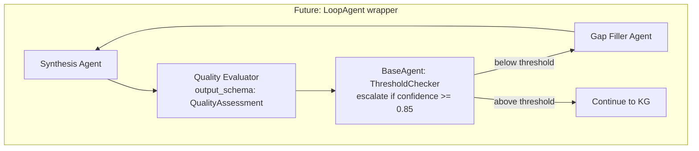

Max iterations: 2-3 for PoC extension.

### 4.9 Tool Registry

| Tool | Used By | Purpose |
|------|---------|---------|
| `load_file` | All Domain Agents | Load file content from GCS via ToolContext |
| `extract_pdf_tables` | All Domain Agents | Tabular data extraction |
| `extract_video_frames` | All Domain Agents | Key frames with timestamps |
| `transcribe_audio` | All Domain Agents | Speaker-diarized transcription |
| `highlight_image_region` | All Domain Agents | Bounding box annotations |
| `analyze_statistics` | Financial Agent | Anomaly detection in numerical data |
| `search_legal_sources` | Legal Agent | Case law and statute search |
| `query_knowledge_graph` | Chat Agent | Search KG entities, relationships, insights by query |
| `search_findings` | Chat Agent | Search raw domain findings for detailed facts |
| `get_source_context` | Chat, Verification | Retrieve source content at location for citation |
| `escalate_to_domain` | Chat Agent | Transfer to Orchestrator for fresh domain analysis |
| `compare_values` | Verification Agent | Compare original vs. proposed vs. source values |

Tools receive `ToolContext` providing access to:
- `tool_context.state` - Read/write session state
- `tool_context.save_artifact()` - Store processed outputs
- `tool_context.load_artifact()` - Retrieve artifacts
- `tool_context.actions.transfer_to_agent` - Optional agent handoff

### 4.10 ADK Integration with FastAPI

The FastAPI server integrates with ADK Runner for processing:

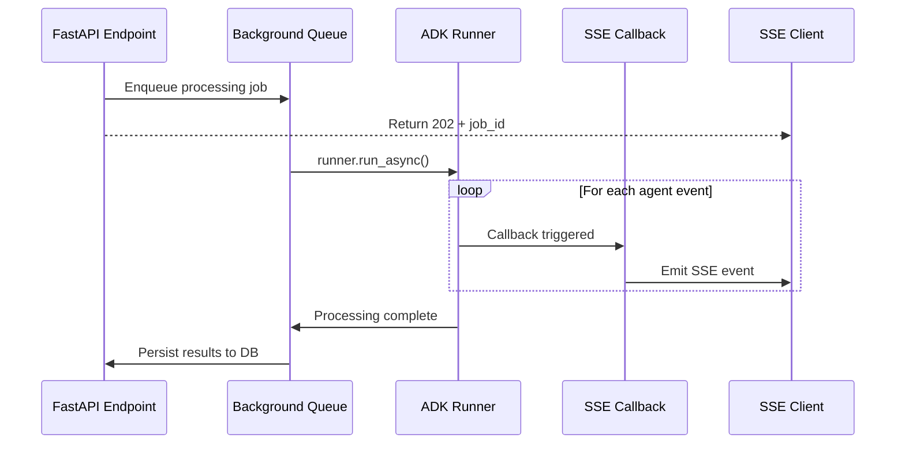

**Key Integration Points**:
1. `Runner` initialized with `DatabaseSessionService` (PostgreSQL) and `GcsArtifactService`
2. Callbacks (`before_agent_callback`, `after_tool_callback`) emit SSE events
3. Processing runs in background task; results persisted on completion
4. Chat uses same Runner with existing session for context continuity

### 4.11 Session and Storage Services

| Service | ADK Component | Purpose |
|---------|--------------|---------|
| Session State | `DatabaseSessionService` | Agent communication during processing (PostgreSQL) |
| Artifacts | `GcsArtifactService` | Processed file outputs, intermediate results |
| Application Data | PostgreSQL (direct) | Cases, files metadata, final graphs, chat history |
| Raw Files | Cloud Storage | Uploaded evidence files |

**Why PostgreSQL over Firestore**: 
- `DatabaseSessionService` requires PostgreSQL - single DB simplifies infrastructure
- JSONB columns handle flexible schemas (findings, graphs)
- Transactional consistency for multi-table updates

### 4.12 Chat Agent Architecture

The Chat Agent provides contextual Q&A over case knowledge using a **knowledge-first with escalation** pattern:

**Design Principles**:
- Primary: Query persisted Knowledge Graph and Findings Store (fast, consistent)
- Secondary: Escalate novel questions to domain agents via Orchestrator (expensive, fresh analysis)
- All responses include source citations linking to Source Panel
- **Streaming responses**: Tokens stream via SSE as they're generated for responsive UX

**Session Sharing**: Chat Agent reuses the same ADK session (`case_{id}`) as processing pipeline, giving it access to all state keys (`knowledge_graph`, `*_findings`, `synthesis_results`).

**Chat History Persistence**:
- Messages stored in PostgreSQL `messages` table (not just ADK session state)
- Each message includes: `role`, `content`, `citations` (JSONB), `thinking_trace` (JSONB)
- Enables chat history retrieval across browser sessions
- ADK session provides runtime context; PostgreSQL provides durable history

**Chat Agent Tools**:

| Tool | Purpose |
|------|--------|
| `query_knowledge_graph` | Search entities, relationships, contradictions, gaps by semantic query + filters (layer, entity type) |
| `search_findings` | Search raw domain findings for detailed facts not fully in graph |
| `get_source_context` | Retrieve exact source content (page, timestamp, bbox) for citation verification |
| `escalate_to_domain` | Triggers `transfer_to_agent` → Orchestrator for questions requiring fresh analysis |

**Escalation Flow**:
```
User asks novel question → Chat Agent determines KG insufficient →
  calls escalate_to_domain(question, domain) →
  transfer_to_agent("Orchestrator") →
  Orchestrator routes to Domain Agent(s) →
  new findings returned → Chat Agent formulates response
```

**Thinking Mode**: `medium` with `include_thoughts=True` for complex queries (visible in Trace Theater).

### 4.13 Verification Agent

Handles user-initiated corrections before they're applied to the knowledge graph:

**Workflow**:
1. User flags error (e.g., "Amount is $3.2M, not $2.34M")
2. Verification Agent receives: `{target_id, original_value, proposed_correction, user_justification}`
3. Agent loads original source file(s) via `get_source_context` tool
4. Agent compares source content against both original and proposed values
5. Outputs: `CONFIRMED` | `REJECTED` | `AMBIGUOUS` with evidence citations

**On CONFIRMED**:
- Creates correction record in `corrections` table
- Triggers Merge Agent for incremental KG update
- Marks affected downstream items as STALE

**On REJECTED/AMBIGUOUS**:
- Returns explanation with source citations to user
- User can provide additional context and retry

### 4.14 Merge Agent

Handles incremental knowledge graph updates for both corrections and new file uploads:

**Responsibilities**:

1. **Entity Resolution**: Match new entities to existing graph nodes
   - Same entity, different mentions → merge with alias
   - Similar but distinct → keep separate, note similarity score

2. **Relationship Merging**: Combine edges from new findings
   - Compatible values → aggregate confidence
   - Conflicting values → **FLAG FOR USER** (never auto-resolve)

3. **Conflict Detection**: Surface contradictions between new and existing
   - Create `contradiction` record with both sources
   - User resolves via: Trust New | Keep Existing | Manual Merge

4. **Incremental Update**: Modify graph surgically
   - Update affected nodes/edges only
   - Mark dependents as STALE (user decides regeneration)

**Output Schema** (`merge_plan`):
```
{
  entities_to_merge: [{new_id, existing_id, merge_confidence}],
  new_entities: [...],
  relationships_to_add: [...],
  conflicts: [{type, existing_source, new_source, severity}],
  stale_items: [item_ids affected by changes]
}
```

### 4.15 New File Processing (Incremental)

When files are added to an existing case:

```
1. Triage Agent → processes NEW files only
2. Orchestrator → routes to Domain Agent(s)
3. Domain Agent(s) → outputs new_findings
4. Merge Agent → compares with existing KG:
   IF no conflicts → incremental KG update
   IF conflicts → surface to user for resolution
5. User resolves conflicts → Merge Agent applies
6. Downstream items marked STALE → user prompted to regenerate
```

**Key Principle**: Conflicts are NEVER auto-resolved. User maintains control over case truth.

---

## 5. Directory Structure

```
holmes/
├── README.md
├── pyproject.toml                    # UV workspace root
├── uv.lock                           # Single lockfile
└── Makefile                          # Common commands
├── .github/
│   └── workflows/
│       ├── ci.yml
│       └── deploy.yml                # Deploy on main merge
│
├── infrastructure/
│   ├── terraform/
│   │   ├── main.tf
│   │   ├── variables.tf
│   │   ├── cloud-sql.tf          # PostgreSQL instance
│   │   ├── cloud-storage.tf
│   │   └── cloud-run.tf
│   └── Dockerfile
│
├── shared/
│   ├── pyproject.toml                # UV workspace member (common lib)
│   └── src/
│       └── holmes_shared/
│           ├── __init__.py
│           ├── constants.py          # Shared constants
│           ├── exceptions.py         # Custom exceptions
│           └── types.py              # Shared type definitions
│
├── backend/
│   ├── pyproject.toml                # UV workspace member
│   ├── uv.lock
│   │
│   ├── src/
│   │   └── holmes_backend/
│   │       ├── __init__.py
│   │       ├── main.py               # FastAPI entrypoint
│   │       ├── config.py             # Settings & environment
│   │       │
│   │       ├── api/
│   │       │   ├── __init__.py
│   │       │   ├── routes/
│   │       │   │   ├── auth.py           # Auth endpoints (signup, login, OAuth)
│   │       │   │   ├── cases.py          # Case endpoints
│   │       │   │   ├── files.py          # File endpoints
│   │       │   │   ├── chat.py           # Chat endpoints
│   │       │   │   ├── graphs.py         # Knowledge graph endpoints
│   │       │   │   ├── corrections.py    # Correction & conflict endpoints
│   │       │   │   └── events.py     # SSE streaming endpoint
│   │       │   ├── deps.py
│   │       │   └── middleware.py
│   │       │
│   │       ├── agents/
│   │       │   ├── __init__.py
│   │       │   ├── pipeline.py       # SequentialAgent pipeline builder
│   │       │   ├── orchestrator/
│   │       │   │   ├── __init__.py
│   │       │   │   ├── agent.py          # OrchestratorAgent
│   │       │   │   ├── router.py         # File routing logic
│   │       │   │   └── spawner.py        # Dynamic agent spawning
│   │       │   ├── triage/
│   │       │   │   ├── __init__.py
│   │       │   │   └── agent.py          # TriageAgent
│   │       │   ├── domains/
│   │       │   │   ├── __init__.py
│   │       │   │   ├── base.py
│   │       │   │   ├── financial.py
│   │       │   │   ├── legal.py
│   │       │   │   └── strategy.py
│   │       │   ├── synthesis/
│   │       │   │   ├── __init__.py
│   │       │   │   └── agent.py          # SynthesisAgent - Cross-modal, contradictions, gaps
│   │       │   ├── knowledge_graph/
│   │       │   │   ├── __init__.py
│   │       │   │   └── agent.py          # KnowledgeGraphAgent
│   │       │   ├── chat/
│   │       │   │   ├── __init__.py
│   │       │   │   ├── agent.py          # ChatAgent - Knowledge-first Q&A
│   │       │   │   └── tools.py          # query_knowledge_graph, search_findings, etc.
│   │       │   ├── verification/
│   │       │   │   ├── __init__.py
│   │       │   │   └── agent.py          # VerificationAgent - Validates corrections
│   │       │   ├── merge/
│   │       │   │   ├── __init__.py
│   │       │   │   └── agent.py          # MergeAgent - Incremental KG updates
│   │       │   ├── callbacks.py      # SSE emitter callbacks
│   │       │   └── runner.py         # Runner factory with services
│   │       │
│   │       ├── tools/
│   │       │   ├── __init__.py
│   │       │   ├── file_tools.py
│   │       │   ├── analysis_tools.py
│   │       │   └── search_tools.py
│   │       │
│   │       ├── services/
│   │       │   ├── __init__.py
│   │       │   ├── case_service.py
│   │       │   ├── file_service.py
│   │       │   ├── processing_service.py  # Triggers ADK runner
│   │       │   ├── graph_service.py
│   │       │   ├── chat_service.py
│   │       │   └── correction_service.py  # Verification & merge orchestration
│   │       │
│   │       ├── repositories/
│   │       │   ├── __init__.py
│   │       │   ├── base.py
│   │       │   ├── case_repository.py
│   │       │   ├── file_repository.py
│   │       │   ├── correction_repository.py
│   │       │   ├── finding_repository.py
│   │       │   └── graph_repository.py
│   │       │
│   │       ├── models/
│   │       │   ├── __init__.py
│   │       │   ├── case.py
│   │       │   ├── file.py
│   │       │   ├── finding.py
│   │       │   ├── graph.py
│   │       │   └── events.py
│   │       │
│   │       └── db/
│   │           ├── __init__.py
│   │           └── database.py       # SQLAlchemy async setup
│
├── frontend/
│   ├── package.json
│   ├── tsconfig.json
│   ├── next.config.js
│   ├── tailwind.config.js
│   │
│   ├── src/
│   │   ├── app/
│   │   │   ├── layout.tsx
│   │   │   ├── page.tsx
│   │   │   ├── cases/
│   │   │   │   ├── new/
│   │   │   │   │   └── page.tsx
│   │   │   │   └── [caseId]/
│   │   │   │       ├── page.tsx
│   │   │   │       └── layout.tsx
│   │   │   └── api/
│   │   │
│   │   ├── components/
│   │   │   ├── ui/
│   │   │   ├── cases/
│   │   │   ├── files/
│   │   │   ├── visualizations/
│   │   │   │   ├── agent-flow/           # Essentially the Agent decision graph
│   │   │   │   │   ├── AgentFlow.tsx
│   │   │   │   │   ├── AgentNode.tsx    # Shows thinking trace on expand
│   │   │   │   │   └── AgentEdge.tsx
│   │   │   │   ├── knowledge-graph/
│   │   │   │   │   ├── GraphView.tsx
│   │   │   │   │   ├── GraphNode.tsx
│   │   │   │   │   ├── GraphControls.tsx
│   │   │   │   │   └── InsightPanel.tsx  # Contradictions, gaps, links
│   │   │   │   ├── timeline/
│   │   │   │   └── source-panel/
│   │   │   │       ├── PDFViewer.tsx
│   │   │   │       ├── VideoPlayer.tsx
│   │   │   │       ├── AudioPlayer.tsx
│   │   │   │       └── ImageViewer.tsx
│   │   │   └── chat/
│   │   │       ├── ChatPanel.tsx
│   │   │       ├── ChatMessage.tsx
│   │   │       └── CitationLink.tsx
│   │   │
│   │   ├── hooks/
│   │   │   ├── useSSE.ts             # SSE subscription hook
│   │   │   ├── useCase.ts
│   │   │   ├── useChat.ts
│   │   │   └── useKnowledgeGraph.ts
│   │   │
│   │   ├── stores/
│   │   │   ├── caseStore.ts          # Zustand store
│   │   │   ├── fileStore.ts
│   │   │   ├── graphStore.ts
│   │   │   ├── chatStore.ts
│   │   │   ├── agentStore.ts
│   │   │   └── streamStore.ts        # SSE event store
│   │   │
│   │   ├── lib/
│   │   │   ├── apiClient.ts                # API client (generated)
│   │   │   ├── sseClient.ts
│   │   │   └── utils.ts
│   │   │
│   │   └── types/
│   │       ├── api.ts
│   │       ├── graph.ts
│   │       └── events.ts
│   │
│   └── public/
│
└── scripts/
    ├── setup-gcp.sh
    ├── deploy.sh
    └── generate-types.sh
```

---

## 6. Data Schema (PostgreSQL)

### 6.1 Entity Relationship Diagram

> **NOTE 1**: **Auth Tables**: Managed by Better Auth (TypeScript). Python backend reads these tables but does not write to them. Tables: `user`, `session`, `account`, `verification`.
> - The `user` table schema is managed by Better Auth. 
> - Custom field `username` added via Better Auth's `additionalFields` config.

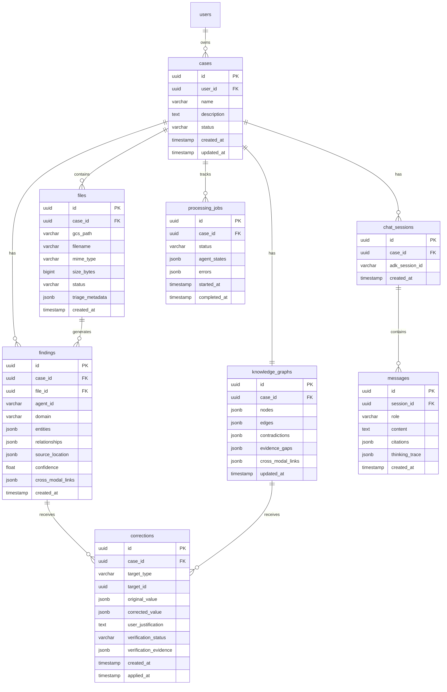

**findings table additions**:
```sql
-- Add versioning support to findings
version INT DEFAULT 1
superseded_by UUID REFERENCES findings(id)
status VARCHAR DEFAULT 'active'  -- 'active' | 'superseded' | 'stale'
```

**Chat persistence notes**:
- `chat_sessions` links a case to its ADK session ID for runtime context continuity
- `messages` stores conversation history for retrieval across browser sessions
- `messages.citations` JSONB: `[{file_id, location, excerpt}]` for source linking
- `messages.thinking_trace` JSONB: agent reasoning captured for Trace Theater (optional)

### 6.2 Key JSONB Schemas

**files.triage_metadata**:
```json
{
  "classification": "Evidence|Legal/Statute|Legal/Precedent|Strategy/Playbook|Reference",
  "domain_scores": {"financial": 0.95, "legal": 0.40, "strategy": 0.20},
  "complexity_score": 0.72,
  "page_count": 156,
  "duration_seconds": null,
  "entities_preview": ["John Doe", "Shell Corp LLC"],
  "key_dates": ["2023-03-15", "2023-04-03"]
}
```

**knowledge_graphs.contradictions**:
```json
[
  {
    "id": "contradiction_001",
    "claim": "I was in New York on March 15th",
    "claim_source": {"file_id": "...", "timestamp": "14:32", "speaker": "John Doe"},
    "evidence_against": [
      {"file_id": "...", "description": "Video showing subject in LA at 02:34"},
      {"file_id": "...", "description": "Receipt in LA at 02:41"}
    ],
    "severity": "HIGH"
  }
]
```

**knowledge_graphs.evidence_gaps**:
```json
[
  {
    "element": "Destination of funds after Cayman transfer",
    "current_strength": "MISSING",
    "recommendation": "Subpoena Cayman Islands account records"
  }
]
```

**knowledge_graphs.cross_modal_links**:
```json
[
  {
    "source_a": {"file_id": "...", "type": "video", "timestamp": "02:34:17"},
    "source_b": {"file_id": "...", "type": "image", "location": "receipt timestamp"},
    "correlation_type": "TEMPORAL_PROXIMITY",
    "time_delta_seconds": 420,
    "implication": "Subject made purchase within 7 minutes of warehouse entry"
  }
]
```

---

## 7. API Design

### 7.1 REST Endpoints

| Method | Endpoint | Purpose |
|--------|----------|---------|
| **Cases** | | |
| GET | `/api/cases` | List all cases |
| POST | `/api/cases` | Create new case |
| GET | `/api/cases/{id}` | Get case details |
| DELETE | `/api/cases/{id}` | Delete case (cascades) |
| **Files** | | |
| POST | `/api/cases/{id}/files` | Upload files (multipart) |
| GET | `/api/cases/{id}/files` | List case files |
| GET | `/api/files/{id}` | Get file metadata |
| GET | `/api/files/{id}/content` | Get file content (signed URL) |
| DELETE | `/api/files/{id}` | Delete file |
| **Processing** | | |
| POST | `/api/cases/{id}/process` | Trigger processing |
| GET | `/api/cases/{id}/process/status` | Get processing status |
| **Knowledge Graph** | | |
| GET | `/api/cases/{id}/graph` | Get knowledge graph with insights |
| PATCH | `/api/cases/{id}/graph` | Update graph (user corrections) |
| GET | `/api/cases/{id}/timeline` | Get timeline events |
| GET | `/api/cases/{id}/insights` | Get contradictions, gaps, links |
| **Chat** | | |
| POST | `/api/cases/{id}/chat` | Send message, get streaming response (SSE: token chunks + final citations) |
| GET | `/api/cases/{id}/chat/history` | Get persisted chat history from PostgreSQL |
| **Corrections** | | |
| POST | `/api/cases/{id}/correct` | Submit correction for verification |
| GET | `/api/cases/{id}/corrections` | List pending/applied corrections |
| POST | `/api/corrections/{id}/apply` | Apply verified correction |
| DELETE | `/api/corrections/{id}` | Reject/cancel correction |
| **Conflicts** | | |
| GET | `/api/cases/{id}/conflicts` | List unresolved conflicts |
| POST | `/api/conflicts/{id}/resolve` | Resolve conflict (trust_new, keep_existing, manual) |
| **Events** | | |
| GET | `/api/cases/{id}/events` | SSE stream for case |
| **Authentication** | | |
| POST | `/api/auth/signup` | Create account (email/password) |
| POST | `/api/auth/login` | Authenticate, return JWT |
| POST | `/api/auth/google` | Exchange Google OAuth code for JWT |
| POST | `/api/auth/logout` | Invalidate session |
| GET | `/api/auth/me` | Get current user profile |

### 7.2 SSE Event Types

```typescript
type SSEEventType = 
  | "PROCESSING_STARTED"
  | "AGENT_SPAWNED"
  | "AGENT_PROGRESS"
  | "THINKING_UPDATE"      // Agent reasoning trace
  | "TOOL_INVOKED"
  | "AGENT_COMPLETED"
  | "AGENT_ERROR"
  | "INSIGHT_DETECTED"     // Contradiction, gap, or link found
  | "GRAPH_UPDATED"
  | "CHAT_TOKEN"            // Streaming token from Chat Agent
  | "CHAT_COMPLETE"         // Final response with citations
  | "CORRECTION_VERIFIED"   // Verification agent confirmed/rejected
  | "CONFLICT_DETECTED"     // New file conflicts with existing KG
  | "STALE_ITEMS_MARKED"    // Items need regeneration after correction
  | "PROCESSING_COMPLETED"
  | "PROCESSING_FAILED";
```

---

## 8. Error Handling Strategy

### 8.1 Retry Policy

| Component | Retry Count | Backoff | Fallback |
|-----------|-------------|---------|----------|
| Gemini API calls | 3 | Exponential (1s, 2s, 4s) | Mark agent as FAILED, continue others |
| GCS operations | 3 | Linear (500ms) | Fail file, log error |
| PostgreSQL writes | 3 | Exponential | Queue for retry, continue |
| Tool executions | 2 | None | Return partial result, log |

### 8.1.1 Retry Handling Pseudocode

```
RETRY_CONFIG:
  max_attempts: 3
  backoff: exponential (1s, 2s, 4s)

ON_AGENT_FAILURE(agent, error):
  1. Log error with full context (agent_id, input, traceback)
  2. FOR attempt IN 1..max_attempts:
       result = retry_agent(agent)
       IF success: RETURN result
       WAIT backoff[attempt]
  3. IF still failing:
       - Mark files processed by agent as PARTIAL
       - Persist any partial findings to PostgreSQL
       - Emit SSE: AGENT_ERROR with details
       - Continue with remaining agents in pipeline
  4. User can manually retry failed items via UI

ON_LLM_TIMEOUT(agent, timeout_seconds):
  - Default timeout: 120s for domain agents, 30s for triage
  - On timeout: Retry once with reduced context window if possible
  - If still fails: Mark PARTIAL, emit SSE: AGENT_TIMEOUT

ON_RATE_LIMIT(error):
  - Queue pending requests
  - Apply exponential backoff (30s, 60s, 120s)
  - Prioritize: Chat queries > Active processing > Background tasks
  - Emit SSE: PROCESSING_DELAYED with estimated resume time
```

### 8.2 Error Propagation

```
Agent Error → Orchestrator notified → 
  IF critical (Orchestrator/KG): Mark job FAILED, notify user
  IF non-critical (Domain worker): 
    Mark specific files as PARTIAL
    Continue with remaining agents
    Notify user of partial results
```

### 8.3 Error Categories

| Category | Handling | User Impact |
|----------|----------|-------------|
| `TRANSIENT` | Auto-retry with backoff | None if resolved |
| `FILE_CORRUPT` | Mark file ERROR, skip | User notified, can re-upload |
| `AGENT_TIMEOUT` | Retry once, then PARTIAL | Partial results shown |
| `QUOTA_EXCEEDED` | Pause, notify user | Processing delayed |
| `SYSTEM_ERROR` | Log, alert, fail gracefully | User sees error state |

### 8.4 Error Response Format

All API errors return a consistent JSON structure:

```json
{
  "error": {
    "code": "PROCESSING_FAILED",
    "message": "Failed to process file after 3 attempts",
    "details": {
      "file_id": "abc-123-def",
      "agent_id": "financial_agent",
      "last_error": "LLM timeout after 120s",
      "attempts": 3
    },
    "recoverable": true,
    "suggested_action": "retry"
  }
}
```

**Error codes**: `VALIDATION_ERROR`, `FILE_CORRUPT`, `PROCESSING_FAILED`, `AGENT_TIMEOUT`, `QUOTA_EXCEEDED`, `CONFLICT_DETECTED`, `SYSTEM_ERROR`

### 8.5 Graceful Degradation

| Scenario | Degradation Strategy |
|----------|---------------------|
| Partial file processing | Show results for successful files; clearly mark failed files with retry button |
| Model unavailable | Attempt fallback: Gemini 3 Pro → Gemini 3 Flash for simpler analysis |
| SSE disconnection | Frontend shows "Reconnecting..." with auto-retry (exponential backoff) |
| Stale data | Display last-known-good state with timestamp; show refresh prompt |
| KG build fails | Preserve domain findings; allow access to raw findings without graph visualization |

---

## 9. User Journey Flow

### 9.1 Complete User Journey

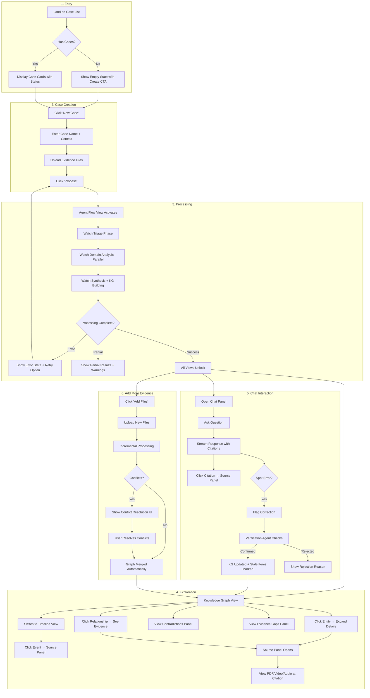

### 9.2 State Diagram

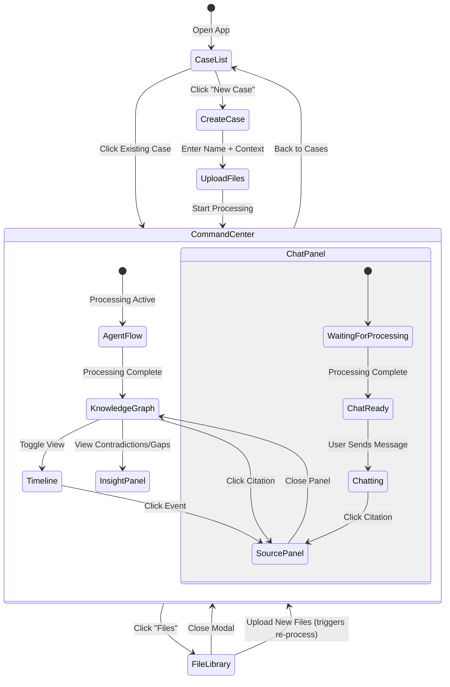

### 9.1 View State Matrix

| Processing State | Agent Flow | Knowledge Graph | Timeline | Source Panel | Chat | Insights Panel |
|-----------------|------------|-----------------|----------|--------------|------|----------------|
| PENDING | Disabled | Disabled | Disabled | Disabled | Disabled | Disabled |
| PROCESSING | **Active** | Disabled | Disabled | Disabled | Disabled | Disabled |
| READY | Enabled | **Default** | Enabled | Enabled | **Enabled** | **Enabled** |
| PARTIAL | Enabled | Enabled (warnings) | Enabled | Enabled | Enabled | Enabled |
| ERROR | Enabled (shows errors) | Disabled | Disabled | Disabled | Disabled | Disabled |

---

## 10. Deployment Architecture

### 10.1 GCP Resource Layout

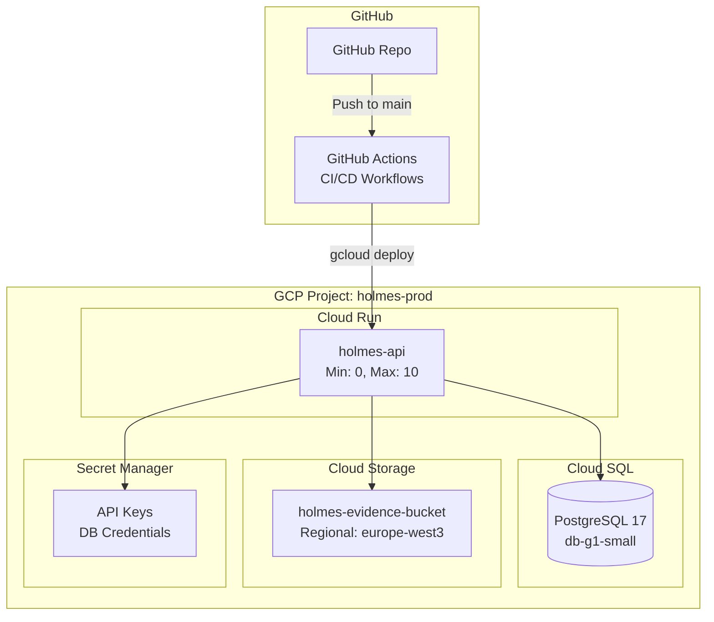

**Why GitHub Actions over Cloud Build**:
- Faster setup - no GCP API enabling or IAM role binding needed
- Better debugging - logs inline in GitHub PR/commit view
- Simpler iteration on workflow files
- Sufficient GCP integration via `google-github-actions/deploy-cloudrun`

### 10.2 Deployment Workflow (Hackathon-Optimized)

Simplified CI/CD prioritizing rapid iteration over ceremony:

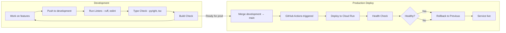

**Branching Strategy**:
- `development` - All feature work happens here, no CI gates
- `main` - Protected, merge triggers production deploy
- No feature branches or PR reviews required (hackathon mode)

**`.github/workflows/deploy.yml`**:
```yaml
name: Deploy to Cloud Run

on:
  push:
    branches: [main]

jobs:
  deploy:
    runs-on: ubuntu-latest
    permissions:
      contents: read
      id-token: write

    steps:
      - uses: actions/checkout@v4

      - id: auth
        uses: google-github-actions/auth@v2
        with:
          workload_identity_provider: ${{ secrets.WIF_PROVIDER }}
          service_account: ${{ secrets.WIF_SERVICE_ACCOUNT }}

      # Source deploy - no Artifact Registry needed
      # Cloud Run builds from source directly
      - uses: google-github-actions/deploy-cloudrun@v2
        with:
          service: holmes-api
          region: europe-west3
          source: ./backend
          env_vars: |
            GCS_BUCKET=holmes-prod-evidence
            LOG_LEVEL=INFO
          secrets: |
            DATABASE_URL=DATABASE_URL:latest
            GEMINI_API_KEY=GEMINI_API_KEY:latest
```

**Why Source Deploy**:
- No Artifact Registry setup required, although use dockerfiles as required efficiently
- Cloud Run auto-detects Python/Node.js or dockerfile and builds
- Faster iteration: push → deploy in ~2 minutes
- Trade-off: Slightly slower cold starts (acceptable for PoC)

**Local Development**:
```bash
# Backend with hot reload
uv run uvicorn holmes_backend.main:app --reload

# Frontend
cd frontend && npm run dev

# ADK agent playground
adk web --agent ./backend/src/holmes/agents
```

**GitHub Secrets Required**:
| Secret | Purpose |
|--------|--------|
| `WIF_PROVIDER` | Workload Identity Federation provider |
| `WIF_SERVICE_ACCOUNT` | GCP service account for deployment |
| `GCP_PROJECT_ID` | Project ID for gcloud commands |

**Rollback Strategy**: If production breaks, revert the merge commit on `main` and push - triggers redeploy of previous working state.

### 10.3 Environment Configuration

| Variable | Dev (Local) | Prod (Cloud Run) |
|----------|-------------|------------------|
| `DATABASE_URL` | `postgresql+asyncpg://localhost/holmes` | From Secret Manager |
| `GCS_BUCKET` | `holmes-dev-evidence` | `holmes-prod-evidence` |
| `GEMINI_API_KEY` | From .env | From Secret Manager |
| `ADK_SESSION_DB` | Same as DATABASE_URL | Same as DATABASE_URL |
| `ALLOWED_ORIGINS` | `localhost:3000` | `https://holmes.app` |
| `LOG_LEVEL` | `DEBUG` | `INFO` |

---

## 11. Future Extensibility Points

### 11.1 Quality Refinement Loop (Post-PoC Priority)

Add `LoopAgent` wrapper around Synthesis phase:
- Quality evaluator scores confidence (0-1)
- Threshold checker escalates if confidence ≥ 0.85
- Gap filler addresses low-confidence areas
- Max 2-3 iterations

### 11.2 Judge Simulation (Planned)

**Integration Points**:
- New agent: `JudgeSimulationAgent` in `agents/`
- New table: `judge_profiles` with verdict history
- New API endpoint: `/api/cases/{id}/simulate/judge`
- Knowledge graph gains "SIMULATION" layer

### 11.3 External Integrations (Future)

| Integration | Extension Point | Notes |
|-------------|----------------|-------|
| Gmail Import | `services/import_service.py` | OAuth flow, email parsing |
| Google Drive | `services/import_service.py` | File picker, sync |
| Export (DOCX/PDF) | `services/export_service.py` | Template-based generation |
| Multi-user | Add `users` table, modify queries | Auth layer needed |

### 11.4 Modular Agent System

New domain agents added by:
1. Create agent in `agents/domains/new_domain.py` with `output_key`
2. Add to `ParallelAgent` in `pipeline.py`
3. Update Synthesis agent instruction to include `{new_domain_findings}`

---

## 12. Non-Functional Requirements

| Requirement | Target | Measurement |
|-------------|--------|-------------|
| File Upload | < 30s for 500MB | P95 latency |
| Triage (per file) | < 10s | P95 latency |
| Full Processing | < 5min for 50 files | P95 latency |
| Chat Response | < 3s (streaming start) | P95 latency |
| SSE Latency | < 500ms | P95 latency |
| Availability | 99% | Uptime monitoring |
| Data Durability | 99.99% | GCS + Cloud SQL SLA |

---

## 13. Security Considerations (PoC Scope)

| Aspect | PoC Approach | Production Note |
|--------|--------------|-----------------|
| Authentication | Email/password + Google OAuth + JWT | Production-ready |
| Authorization | None | Add RBAC |
| Data Encryption | GCP default (at rest + transit) | Sufficient |
| File Validation | MIME type + size check | Add virus scanning |
| API Rate Limiting | None | Add Cloud Armor |
| Secrets | Secret Manager | ✓ Production-ready |
| SQL Injection | SQLAlchemy ORM | ✓ Protected |

---

## 14. Open Decisions / Assumptions

1. **Assumed**: Gemini 3 Pro/Flash preview APIs are stable enough for PoC
2. **Assumed**: 1M token context sufficient for largest expected files
3. **Decided**: PostgreSQL for all persistent storage (simplifies infrastructure)
4. **Decided**: SSE over WebSocket for real-time updates (simpler, sufficient for use case)
5. **Decided**: `DatabaseSessionService` for ADK sessions (PostgreSQL-backed)
6. **Assumed**: Single Cloud Run instance handles concurrent processing (scale if needed)

---

## 15. Appendix A: Technology Versions

| Layer | Technology | Version | Notes |
|-------|------------|---------|-------|
| **Frontend** | | | |
| Framework | Next.js | 16.x | App Router |
| UI Library | React | 19.x | Server Components |
| Styling | TailwindCSS | 4.x | |
| State Management | Zustand | 5.x | |
| Graph Visualization | D3.js | 7.9.x | Knowledge graph |
| Flow Visualization | React Flow | Latest | Agent Flow |
| Type Generation | Hey API | Latest | OpenAPI → TypeScript |
| **Backend** | | | |
| Framework | FastAPI | 0.121+ | Async, OpenAPI |
| Agent Orchestration | Google ADK | Latest | LlmAgent, ParallelAgent, etc. |
| ORM | SQLAlchemy | 2.x | Async support |
| Validation | Pydantic | 2.x | |
| Auth | Better Auth | Latest | Runs in Next.js API routes, shared PostgreSQL |
| **AI Models** | | | |
| Primary | Gemini 3 Pro | Preview | Complex reasoning |
| Fast | Gemini 3 Flash | Preview | Triage, simple tasks |
| **Infrastructure** | | | |
| Database | Cloud SQL PostgreSQL | 15 | JSONB for flexible schemas |
| File Storage | Cloud Storage | - | Regional: europe-west3 |
| Compute | Cloud Run | Gen 2 | 300s timeout |
| Secrets | Secret Manager | - | API keys, DB credentials |
| CI/CD | GitHub Actions | - | Workload Identity Federation |
| **Languages** | | | |
| Backend | Python | 3.13.x | UV for package management |
| Frontend | TypeScript | 5.9.x | Strict mode |
| Monorepo | UV Workspaces | Latest | Single lockfile |

---

## 16. Appendix B: Glossary

| Term | Definition |
|------|------------|
| **ADK** | Agent Development Kit - Google's framework for building AI agents |
| **Agent Flow** | UI visualization showing agent execution flow, reasoning, and decision transparency |
| **Contradiction** | Conflicting information detected across evidence sources (e.g., alibi vs. location proof) |
| **Domain Agent** | Specialized agent for a specific analysis domain (Financial, Legal, Strategy) |
| **Evidence Gap** | Missing information needed to prove/disprove a case element |
| **Finding** | Structured output from a domain agent's analysis of evidence |
| **Knowledge Graph** | Entity-relationship graph synthesized from all processed evidence |
| **Merge Agent** | Agent responsible for incremental KG updates and conflict detection |
| **Orchestrator** | Central LlmAgent that routes files, spawns domain agents, and coordinates pipeline |
| **output_key** | ADK mechanism for agents to write results to shared session state |
| **ParallelAgent** | ADK agent type that runs sub-agents concurrently |
| **SequentialAgent** | ADK agent type that runs sub-agents in order |
| **Source Panel** | UI component displaying original evidence (PDF, video, audio) at cited location |
| **SSE** | Server-Sent Events - unidirectional streaming from server to client |
| **STALE** | Status indicating data may be outdated due to corrections or new evidence |
| **Synthesis** | Cross-referencing findings across domains to find links, contradictions, gaps |
| **Triage** | Initial fast classification of files by domain relevance and complexity |
| **Verification Agent** | Agent that validates user corrections against original source material |

---

*Document Version: 2.0*  
*Last Updated: January 2026*  
*Status: Ready for Development*