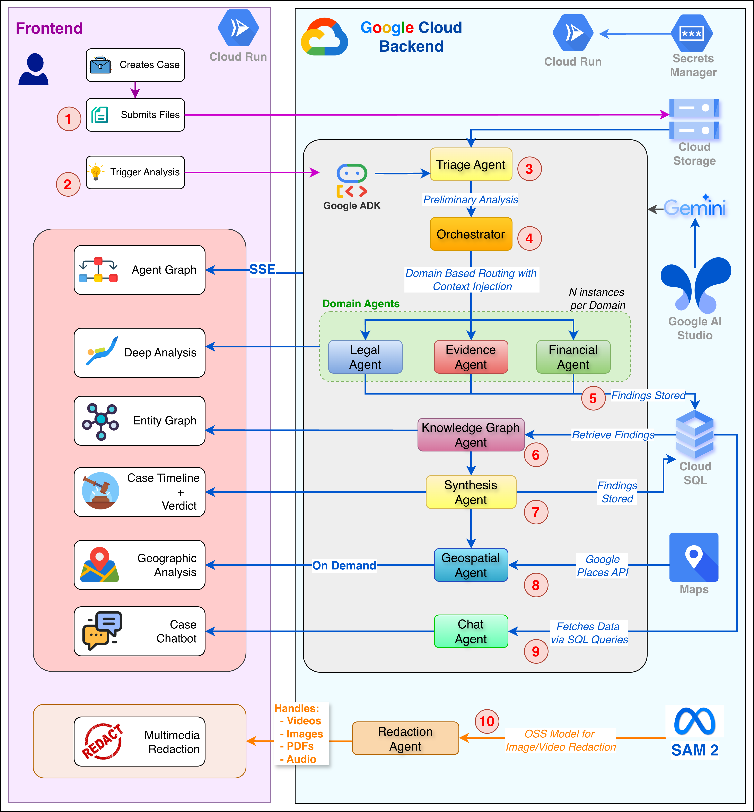

# Holmes

**AI-powered legal intelligence platform** — Processes multimodal evidence through domain-specialized Gemini 3 agents with full reasoning transparency.

Built for the [Gemini 3 Global Hackathon 2026](https://ai.google.dev/gemini-api/docs).

---

## Demo

To try Holmes without setting up locally, use the deployed production instance:

| | |
|---|---|
| **URL** | *<!-- TODO: insert production frontend URL -->* |
| **Email** | `pluses-snow6q@icloud.com` |
| **Password** | `DC5dYLQYqvKVzwD` |
| **Demo Case Files** | [Google Drive folder](https://drive.google.com/drive/folders/10jz5F8epglb7SnRTYbpxc850iA2641GC?usp=drive_link) |

Upload the demo case files to a case and run the analysis pipeline from the Command Center to see the full agent flow, knowledge graph, timeline, geospatial map, and verdict dashboard.

---

## The Problem

Legal professionals and investigators spend **60%+ of their time** manually reviewing evidence across scattered formats — PDFs, video depositions, audio recordings, financial documents, images. They must cross-reference every piece to find connections, contradictions, and gaps. Current AI tools suffer from hallucination and operate as black boxes, making them unusable for legal work that demands transparency, auditability, and exact source citations.

## The Solution

Holmes processes **any combination of evidence types** through a pipeline of 10 domain-specialized AI agents, then surfaces connections, contradictions, and gaps — while showing exactly *how* it reached those conclusions through **Agent Flow**, a real-time visualization of AI reasoning. Every factual claim traces back to its exact source location.

---

## Table of Contents

- [Demo](#demo)
- [Key Features](#key-features)
- [Architecture](#architecture)
- [Agent Pipeline — Deep Dive](#agent-pipeline--deep-dive)
- [Gemini 3 Integration](#gemini-3-integration)
- [Frontend Visualizations](#frontend-visualizations)
- [Real-Time SSE Streaming](#real-time-sse-streaming)
- [AI-Powered Redaction](#ai-powered-redaction)
- [Investigator's Notebook](#investigators-notebook)
- [Database Schema](#database-schema)
- [Tech Stack](#tech-stack)
- [Project Structure](#project-structure)
- [Quick Start](#quick-start)
- [Make Commands](#make-commands)
- [Environment Variables](#environment-variables)
- [Deployment](#deployment)
- [License](#license)

---

## Key Features

| Feature                     | Description                                                                                                            |
| --------------------------- | ---------------------------------------------------------------------------------------------------------------------- |
| **Agent Flow**              | Real-time React Flow canvas showing agent execution, thinking traces, tool calls, and token usage as the pipeline runs |
| **Knowledge Graph**         | D3.js force-directed graph with entity relationships, domain filtering, entity timeline, and source viewer             |
| **Contradiction Detection** | Automatic flagging of conflicting information across evidence, with severity classification and exact source pairs     |
| **Hypothesis System**       | 3-state lifecycle (PENDING → SUPPORTED/REFUTED) with supporting and contradicting evidence weights                     |
| **Evidence Gap Analysis**   | Identifies missing evidence needed to prove case elements, ranked by priority                                          |
| **Timeline View**           | Chronological event visualization with day/week/month/year zoom, layer filtering, and source links                     |
| **Geospatial Map**          | Google Maps integration with location markers, movement patterns, and Street View                                      |
| **Verdict Dashboard**       | Executive summary, key findings, risk assessment, and case verdict with confidence scoring                             |
| **Contextual Chat**         | Tool-based Chat agent with four retrieval tools over the knowledge store, streaming responses with inline citations    |
| **AI-Powered Redaction**    | Gemini-powered intelligent redaction of PDFs, images, and videos via natural language prompts                          |
| **Investigator's Notebook** | Voice and text note capture tied to case context                                                                       |
| **Span-Level Citations**    | Every claim traced to exact file, page number, timestamp, or region with verbatim excerpts                             |

---

## Architecture



```
┌──────────────────────────────────────────────────────────────────┐
│                          Frontend                                 │
│  Next.js 16 · React 19 · React Flow · D3.js · Google Maps       │
│  Agent Flow | Knowledge Graph | Timeline | Map | Verdict | Chat  │
└────────────────────────────┬─────────────────────────────────────┘
                             │ SSE (real-time streaming)
┌────────────────────────────▼─────────────────────────────────────┐
│                          Backend                                  │
│  FastAPI · Google ADK · 10-Agent Pipeline · SSE Publisher         │
│                                                                   │
│  Triage → Orchestrator → Domain Agents (parallel) → Strategy     │
│  → HITL Confirmation → KG Builder → Synthesis → Geospatial       │
└────────────────────────────┬─────────────────────────────────────┘
                             │
         ┌───────────────────┼───────────────────┐
         ▼                   ▼                   ▼
┌─────────────────┐ ┌─────────────────┐ ┌─────────────────┐
│   PostgreSQL    │ │  Cloud Storage  │ │    Gemini 3     │
│  Sessions, KG,  │ │   Evidence      │ │  Pro (reasoning)│
│  Findings,      │ │   Files         │ │  Flash (triage) │
│  Synthesis      │ │                 │ │  File API (2GB) │
└─────────────────┘ └─────────────────┘ └─────────────────┘
```

### Design Principles

- **Stage-isolated sessions** — Each pipeline stage creates a fresh ADK session to prevent multimodal file content from bloating downstream contexts. Inter-stage data flows via database, not session state.
- **Config-driven agents** — Domain agents share a generic `DomainAgentRunner[OutputT]` template, eliminating ~1200 lines of duplicated run/retry/fallback logic.
- **Pro-to-Flash fallback** — Domain agents attempt Gemini 3 Pro first, falling back to Flash on failure for graceful degradation.
- **Deterministic session IDs** — `SHA-256(case_id:workflow_id:stage)` enables idempotent reruns.
- **Pipeline orchestration via Python** — NOT a single ADK SequentialAgent. Each stage is an independent runner invocation, with parallel execution within stages via `asyncio.gather`.

---

## Agent Pipeline — Deep Dive

The pipeline processes evidence through 8 stages, each running in a fresh ADK session:

### Stage 1: Triage Agent

| Property | Value                        |
| -------- | ---------------------------- |
| Model    | Gemini 3 Flash               |
| Thinking | HIGH                         |
| Input    | All files (multimodal batch) |

Classifies every file by domain relevance (Financial 0-100, Legal 0-100, Evidence 0-100, Strategy 0-100), extracts entities (people, organizations, dates, locations, amounts, legal terms), generates summaries, and assigns complexity tiers. Retry logic creates a fresh session on parse failure to avoid polluted context.

**Output:** `TriageOutput` → domain scores, entity lists, summaries, complexity tier, file groupings.

**Files:** `backend/app/agents/triage.py`, `backend/app/agents/prompts/triage.py`

---

### Stage 2: Orchestrator Agent

| Property | Value                   |
| -------- | ----------------------- |
| Model    | Gemini 3 Pro            |
| Thinking | HIGH                    |
| Input    | Text only (triage JSON) |

Routes files to domain agents based on triage scores. Produces routing decisions with confidence scores, file groups for joint analysis, and parallel/sequential execution plans. Triggers Human-in-the-Loop confirmation when per-agent confidence falls below thresholds (Financial: 50, Legal: 50, Evidence: 20, Strategy: 40).

**Output:** `OrchestratorOutput` → routing decisions, file groups, parallel agents, sequential agents.

**Files:** `backend/app/agents/orchestrator.py`, `backend/app/agents/prompts/orchestrator.py`

---

### Stage 3: Domain Agents (Parallel)

| Agent     | Model | Media Resolution | Specialization                                 |
| --------- | ----- | ---------------- | ---------------------------------------------- |
| Financial | Pro   | HIGH             | Transactions, anomalies, account relationships |
| Legal     | Pro   | HIGH             | Obligations, risks, compliance, clauses        |
| Evidence  | Pro   | HIGH             | Authenticity, chain of custody, corroboration  |

Each agent type runs one instance per file group concurrently via `asyncio.gather`. Each instance creates its own database session (async sessions are not thread-safe). All agents use the config-driven `DomainAgentRunner[OutputT]` template.

**Pro-to-Flash Fallback:** If Pro fails after retries, the runner automatically attempts Flash and emits an `agent-fallback` SSE event.

**Output:** `DomainAgentOutput` → findings with span-level citations, extracted entities, quality assessments (Evidence agent).

**Files:** `backend/app/agents/domain_agent_runner.py`, `backend/app/agents/financial.py`, `backend/app/agents/legal.py`, `backend/app/agents/evidence.py`

---

### Stage 4: Strategy Agent (Sequential)

| Property         | Value        |
| ---------------- | ------------ |
| Model            | Gemini 3 Pro |
| Media Resolution | MEDIUM       |

Runs after parallel domain agents complete. Receives text summaries of all domain findings (not raw files) plus any files explicitly routed to strategy. Produces strategic recommendations and investigation direction analysis.

**Files:** `backend/app/agents/strategy.py`

---

### Stage 5: Human-in-the-Loop Confirmation

Two HITL checkpoints:
1. **Routing HITL** — Before domain agents run, if orchestrator confidence is below threshold for any agent type. Batch confirmation via SSE.
2. **Finding HITL** — After domain agents, for findings with confidence < 40.

Confirmation requests are sent as SSE events. The pipeline awaits user response with a configurable timeout (default: 1 hour).

**Files:** `backend/app/services/confirmation.py`, `backend/app/services/pipeline.py`

---

### Stage 6: Knowledge Graph Builder (LLM-Based)

| Property | Value                                    |
| -------- | ---------------------------------------- |
| Model    | Gemini 3 Pro                             |
| Thinking | HIGH                                     |
| Input    | Text only (all findings + entities JSON) |

An LLM agent (not programmatic) reads all domain findings holistically and produces a curated knowledge graph with:
- **Entities** — PERSON, ORGANIZATION, LOCATION, EVENT, ASSET, FINANCIAL_ENTITY, COMMUNICATION, DOCUMENT — with aliases, descriptions, domain tags, and confidence scores
- **Relationships** — Semantic typed labels (e.g., `employed_by`, `transferred_funds_to`, `owns`) with evidence excerpts and temporal context

Uses clear-and-rebuild pattern: deletes old KG data for the workflow, then writes curated entities and relationships. Lenient parsing with savepoints — malformed items are skipped, not fatal.

**Files:** `backend/app/agents/kg_builder.py`, `backend/app/agents/prompts/kg_builder.py`

---

### Stage 7: Synthesis Agent

| Property | Value                                                                 |
| -------- | --------------------------------------------------------------------- |
| Model    | Gemini 3 Pro                                                          |
| Thinking | HIGH                                                                  |
| Input    | Text only — findings + KG entities + KG relationships + case metadata |

Cross-references all domain findings and knowledge graph data to produce:

| Output                | Description                                                   |
| --------------------- | ------------------------------------------------------------- |
| `case_summary`        | Executive summary of the case                                 |
| `case_verdict`        | Evidence strength assessment with confidence                  |
| `hypotheses`          | Claims with supporting/contradicting evidence                 |
| `contradictions`      | Conflicting claims with severity (minor/significant/critical) |
| `gaps`                | Missing evidence ranked by priority                           |
| `timeline_events`     | Chronological events extracted from findings                  |
| `investigation_tasks` | Recommended next steps                                        |
| `cross_modal_links`   | Temporal correlations across modalities                       |
| `risk_assessment`     | Overall risk evaluation                                       |

Writes to 7 database tables. This is where Gemini 3's 1M context window is critical — the agent sees all findings, all entities, and all relationships in a single call.

**Files:** `backend/app/agents/synthesis.py`, `backend/app/agents/prompts/synthesis.py`

---

### Stage 8: Geospatial Agent (Post-Synthesis)

| Property | Value          |
| -------- | -------------- |
| Model    | Gemini 3 Flash |
| Thinking | HIGH           |

Triggered when synthesis results contain location data. Extracts locations, geocodes via Google Maps API, identifies movement patterns, and flags locations for satellite imagery analysis.

**Files:** `backend/app/agents/geospatial.py`, `backend/app/services/geocoding_service.py`

---

### Chat Agent (On-Demand)

| Property | Value        |
| -------- | ------------ |
| Model    | Gemini 3 Pro |
| Thinking | HIGH         |

Not part of the automatic pipeline. Answers user questions via four specialized tools:

| Tool                    | Speed  | Function                                                      |
| ----------------------- | ------ | ------------------------------------------------------------- |
| `query_knowledge_graph` | <100ms | Entity/relationship lookups with two-hop citation resolution  |
| `get_findings`          | <100ms | Finding retrieval by ID, agent type, category, confidence     |
| `get_synthesis`         | <100ms | Hypotheses, contradictions, gaps, timeline, verdict           |
| `search_findings`       | ~500ms | Full-text search via PostgreSQL `ts_rank` + `plainto_tsquery` |

Each tool factory captures `case_id` via closure and creates independent database sessions per call. The agent's system prompt includes the case summary for immediate context.

**Files:** `backend/app/agents/chat_tools.py`, `backend/app/services/chat_service.py`

---

## Gemini 3 Integration

### Deep Thinking & Reasoning

All agents use `ThinkingConfig` at HIGH level via ADK's `BuiltInPlanner`:

```python
# backend/app/agents/base.py
def create_thinking_planner(level: str = "high") -> BuiltInPlanner:
    return BuiltInPlanner(
        thinking_config=ThinkingConfig(
            thinking_level=ThinkingLevel.HIGH,
            include_thoughts=True,
        )
    )
```

`include_thoughts=True` captures thinking traces which are stored in `agent_executions.thinking_traces` (JSONB) and streamed to the frontend via SSE for full transparency.

### Native Multimodality

Gemini 3 Pro processes PDFs, videos, audio, and images natively — no transcription, OCR, or preprocessing pipelines. Domain agents receive raw evidence files directly:

```python
# backend/app/services/adk_service.py
async def build_domain_agent_content(files, gcs_bucket, prompt):
    parts = [types.Part.from_text(text=prompt)]
    for f in files:
        # Force File API for video/audio regardless of size
        if f.mime_type.startswith(("video/", "audio/")):
            file_part = await prepare_file_via_api(...)
        else:
            file_part = await prepare_file_for_agent(f, gcs_bucket)
        parts.append(file_part)
    return types.Content(role="user", parts=parts)
```

### Tiered File Handling

| File Size   | Strategy | Details                                                                        |
| ----------- | -------- | ------------------------------------------------------------------------------ |
| ≤100MB      | Inline   | Downloaded from GCS, base64 encoded as `inline_data`                           |
| >100MB      | File API | Uploaded to Gemini File API (up to 2GB, 48hr retention)                        |
| Video/Audio | File API | Always File API regardless of size (avoids `VideoMetadata` + inline 500 error) |

File API uploads include async polling with backoff until the file state is `ACTIVE`, with a configurable timeout (default 5 minutes).

### Media Resolution Configuration

| Agent     | Resolution | Tokens/Image | Rationale                                         |
| --------- | ---------- | ------------ | ------------------------------------------------- |
| Financial | HIGH       | 1,120        | Dense scanned invoices, ledgers, fine figures     |
| Legal     | HIGH       | 1,120        | Fine print, signatures, contract details          |
| Evidence  | HIGH       | 1,120        | Forensic-quality analysis, manipulation detection |
| Strategy  | MEDIUM     | 560          | General content, not dense scans                  |
| Triage    | Default    | —            | Classification speed priority                     |

```python
# backend/app/agents/factory.py (Financial example)
generate_content_config=types.GenerateContentConfig(
    media_resolution=types.MediaResolution.MEDIA_RESOLUTION_HIGH,
)
```

### 1M Token Context Window

The stage-isolated architecture strategically uses the 1M context window:
- **Triage** — Processes ALL files in one call (50-200K tokens typical)
- **Domain Agents** — File-group subsets (100-300K tokens per instance)
- **Synthesis** — All findings + all KG data in one call (200-500K tokens) — this is where 1M context is critical for holistic cross-domain analysis

Context is NOT accumulated across stages. Each stage gets a fresh session, preventing "context explosion" from multimodal content.

---

## Frontend Visualizations

### Agent Flow (Command Center)

Real-time visualization of the agent pipeline built with `@xyflow/react` + dagre layout:
- Hierarchical decision tree showing agent nodes with status indicators (running/complete/error)
- Animated edges between decision and file-group nodes
- Click any node to open the details sidebar: model name, input context, tool calls, output findings, token usage (input/output/thoughts), duration
- Execution timeline (Gantt chart) showing agent timing overlap
- Full thinking traces displayed untruncated
- Auto-fitting viewport with smooth animations on node addition

**Files:** `frontend/src/components/CommandCenter/`

### Knowledge Graph

D3.js force-directed graph with Epstein-inspired layout:
- **5 forces** — link, charge (-400), center, collision, radial (connection-count gravity well)
- **Node sizing** — Sqrt-scaled radius by connection count (`d3.scalePow().exponent(0.5)`, 5-100px)
- **Domain colors** — Person (orange), Organization (green), Location (blue), Event (amber)
- **Left panel** — Filters, entity search, keyword filter, domain/type toggles, graph stats
- **Right panel** — Entity timeline showing chronological relationships when a node is selected
- **Interactions** — Click to select, drag to move, scroll to zoom, pan
- Zoom/pan with `d3.zoom()` (scale extent [0.01, 10])

**Files:** `frontend/src/components/knowledge-graph/`, `frontend/src/hooks/useGraphSimulation.ts`

### Timeline View

- Horizontal timeline with day/week/month/year zoom levels
- Events grouped by zoom level, colored by layer (evidence/legal/strategy/financial)
- Click event to open detail modal with source citations
- Real-time updates via SSE for event creation/deletion

**Files:** `frontend/src/components/Timeline/`

### Verdict Dashboard

Scrollable multi-section intelligence dashboard:
1. **Summary & Verdict** — Case conclusion with confidence label (Conclusive/Substantial/Inconclusive)
2. **Key Findings** — 2-column grid ranked by confidence
3. **Hypotheses** — Cards with supporting/contradicting evidence counts
4. **Contradictions** — Side-by-side conflicting claims with severity badges
5. **Evidence Gaps** — Missing information with priority and suggested actions
6. **Investigation Tasks** — Follow-up actions derived from synthesis

**Files:** `frontend/src/components/verdict/`

### Geospatial Map

- Google Maps via `@vis.gl/react-google-maps`
- Landmark markers color-coded by type (crime scene, witness, evidence, suspect)
- Movement paths between locations
- Street View integration
- Location detail panel with geocoding metadata

**Files:** `frontend/src/components/Geospatial/`

---

## Real-Time SSE Streaming

### Backend → Frontend Event Flow

The pipeline publishes events at every agent lifecycle point via ADK callbacks:

| ADK Callback            | SSE Event         | Purpose                    |
| ----------------------- | ----------------- | -------------------------- |
| `before_agent_callback` | `agent-started`   | Node appears on canvas     |
| `after_agent_callback`  | `agent-complete`  | Node marked complete       |
| `before_model_callback` | `thinking-update` | Reasoning started          |
| `after_model_callback`  | `thinking-update` | Thought text + token delta |
| `before_tool_callback`  | `tool-called`     | Tool indicator             |
| `after_tool_callback`   | `tool-called`     | Tool result                |

Additional events: `state-snapshot` (reconnection), `confirmation-required` (HITL), `synthesis-data-ready`, `processing-complete`.

### Infrastructure

- **sse-starlette** for FastAPI SSE endpoints
- **Heartbeat** every 15 seconds (`X-Accel-Buffering: no`) to prevent Cloud Run timeout
- **State snapshot** on reconnect — built from `AgentExecution` records in the database
- **In-memory pubsub** with per-case subscriber queues (maxsize 100)
- **Token delta streaming** — input tokens, output tokens, and thought tokens reported per model call

### Frontend Hooks

| Hook                  | Endpoint                                 | Purpose                    |
| --------------------- | ---------------------------------------- | -------------------------- |
| `useCommandCenterSSE` | `/sse/cases/{id}/command-center/stream`  | Agent lifecycle events     |
| `useTimelineSSE`      | `/api/cases/{id}/timeline/events/stream` | Timeline extraction events |
| `useSourceNavigation` | —                                        | Citation → file resolution |

Reconnection with exponential backoff (max 5 attempts, 2s initial delay).

---

## AI-Powered Redaction

Three redaction agents for censoring sensitive content via natural language prompts:

### PDF Redaction

Gemini 3 Flash reads the full PDF, identifies content matching the user's prompt (e.g., "Redact all personal names and phone numbers"), and returns structured `RedactionTarget` objects with exact text, page number, and surrounding context. PyMuPDF then applies black-box redactions at the identified locations.

**Files:** `backend/app/agents/redaction.py`

### Image Redaction

AI-powered segmentation identifies regions to censor (faces, license plates, etc.) based on natural language prompts. Supports blur and pixelate methods. Returns both the censored image and a visualization showing detected masks.

**Files:** `backend/app/agents/image_redaction.py`

### Video Redaction

Frame-by-frame processing with AI-powered region detection. Supports blur, pixelate, and blackbox methods. Returns censored video with processing logs and frame-level statistics.

**Files:** `backend/app/agents/video_redaction.py`

### API Endpoints

```
POST /api/cases/{caseId}/files/{fileId}/redact          # PDF redaction
POST /api/cases/{caseId}/files/{fileId}/redact-image     # Image redaction
POST /api/cases/{caseId}/files/{fileId}/redact-video     # Video redaction
```

---

## Investigator's Notebook

A case-scoped note-taking system ("Sherlock's Diary") for investigators:
- **Voice notes** — Browser MediaRecorder API captures audio, stored as blobs
- **Text notes** — Rich text editor for written observations
- **Case-linked** — All notes tied to the active case for context
- **CRUD API** — Create, list, update, delete notes per case

**Files:** `frontend/src/components/notebook/Notebook.tsx`, `backend/app/api/notes.py`, `backend/app/models/note.py`

---

## Database Schema

PostgreSQL 17 with JSONB for flexible metadata. Key tables:

### Core

| Table              | Purpose                                                                                               |
| ------------------ | ----------------------------------------------------------------------------------------------------- |
| `cases`            | Investigation cases — status (DRAFT/PROCESSING/READY/ERROR), verdict_label, latest_workflow_id        |
| `case_files`       | Uploaded documents — processing status, storage paths, MIME types                                     |
| `agent_executions` | Agent run records — input_data, output_data, status, model_name, tokens, duration, thinking_traces    |
| `case_findings`    | Agent-produced findings — enriched citations (JSONB), entity_ids, confidence, finding_text (markdown) |

### Knowledge Graph

| Table              | Purpose                                                                                      |
| ------------------ | -------------------------------------------------------------------------------------------- |
| `kg_entities`      | Entities — name_normalized, entity_type, domain, confidence, description, aliases, degree    |
| `kg_relationships` | Typed edges — relationship_type, label, strength (0-100), evidence_excerpt, temporal_context |

### Synthesis Layer

| Table                  | Purpose                                                                     |
| ---------------------- | --------------------------------------------------------------------------- |
| `case_synthesis`       | Final verdict, summary, key findings, reasoning                             |
| `case_hypotheses`      | Hypotheses — status (PENDING/SUPPORTED/REFUTED), confidence, evidence links |
| `case_contradictions`  | Conflicting claims — severity, involved entities                            |
| `case_gaps`            | Missing evidence — priority, suggested actions                              |
| `timeline_events`      | Temporal events — layer, date range, entities, narrative                    |
| `geospatial_locations` | Landmarks — coordinates, address, geocoding metadata                        |
| `investigation_tasks`  | Agent-generated follow-up tasks                                             |
| `notes`                | Investigator notebook entries                                               |

All tables use UUIDs, are indexed on `case_id`, and support JSONB for flexible metadata. Migrations managed by Alembic.

---

## Tech Stack

| Layer              | Technology                                                                           |
| ------------------ | ------------------------------------------------------------------------------------ |
| **Frontend**       | Next.js 16, React 19, Tailwind CSS 4, Zustand, TanStack React Query                  |
| **Visualization**  | @xyflow/react (Agent Flow), D3.js (Knowledge Graph), @vis.gl/react-google-maps (Map) |
| **Backend**        | FastAPI, Python 3.12, SQLAlchemy 2.0 (async), Alembic, sse-starlette                 |
| **AI/Agents**      | Google ADK ≥1.22, google-genai, Gemini 3 Pro + Flash                                 |
| **Database**       | PostgreSQL 17 (Cloud SQL in production)                                              |
| **Storage**        | Google Cloud Storage (evidence files)                                                |
| **Infrastructure** | GCP Cloud Run, Artifact Registry, Secret Manager                                     |
| **CI/CD**          | GitHub Actions with Workload Identity Federation                                     |
| **Auth**           | Better Auth (Next.js API routes, shared PostgreSQL)                                  |
| **PDF Processing** | PyMuPDF (redaction, rendering)                                                       |
| **Geocoding**      | Google Maps API (googlemaps)                                                         |

---

## Project Structure

```
holmes/
├── backend/
│   ├── app/
│   │   ├── agents/              # All 10+ agent implementations
│   │   │   ├── base.py          # Model constants, thinking planner, SSE callbacks
│   │   │   ├── factory.py       # AgentFactory — creates fresh agent instances
│   │   │   ├── triage.py        # Stage 1: File classification
│   │   │   ├── orchestrator.py  # Stage 2: Routing decisions
│   │   │   ├── domain_agent_runner.py  # Generic runner template
│   │   │   ├── financial.py     # Domain: Financial analysis config
│   │   │   ├── legal.py         # Domain: Legal analysis config
│   │   │   ├── evidence.py      # Domain: Evidence/forensic config
│   │   │   ├── strategy.py      # Domain: Strategy analysis (sequential)
│   │   │   ├── kg_builder.py    # Stage 6: LLM-based knowledge graph
│   │   │   ├── synthesis.py     # Stage 7: Cross-domain synthesis
│   │   │   ├── geospatial.py    # Stage 8: Location intelligence
│   │   │   ├── chat_tools.py    # Chat agent's 4 retrieval tools
│   │   │   ├── redaction.py     # PDF redaction agent
│   │   │   ├── image_redaction.py   # Image censorship agent
│   │   │   ├── video_redaction.py   # Video censorship agent
│   │   │   └── prompts/         # System prompts for each agent
│   │   ├── api/                 # FastAPI route handlers
│   │   ├── models/              # SQLAlchemy ORM models
│   │   ├── schemas/             # Pydantic request/response schemas
│   │   └── services/            # Business logic
│   │       ├── pipeline.py      # Main pipeline orchestrator (~1200 lines)
│   │       ├── adk_service.py   # ADK session management, file preparation
│   │       ├── chat_service.py  # Chat agent runner
│   │       └── confirmation.py  # HITL confirmation service
│   ├── alembic/                 # Database migrations
│   ├── Dockerfile
│   └── pyproject.toml
├── frontend/
│   ├── src/
│   │   ├── components/
│   │   │   ├── CommandCenter/   # Agent Flow canvas + detail sidebar
│   │   │   ├── knowledge-graph/ # D3.js graph + filter/timeline panels
│   │   │   ├── Timeline/        # Chronological event view
│   │   │   ├── verdict/         # Synthesis dashboard
│   │   │   ├── Geospatial/      # Google Maps view
│   │   │   ├── library/         # Evidence file management + redaction
│   │   │   ├── notebook/        # Investigator's notebook
│   │   │   ├── source-viewer/   # PDF/video/audio/image viewers
│   │   │   └── app/             # Layout, sidebar, chatbot
│   │   ├── hooks/               # React hooks (SSE, graph simulation, filters)
│   │   └── lib/                 # API clients, utilities, citation parsing
│   ├── Dockerfile
│   └── package.json
├── packages/types/              # Shared TypeScript types (auto-generated from OpenAPI)
├── .github/workflows/           # CI/CD pipeline
├── docker-compose.yml           # Local PostgreSQL + Adminer
├── Makefile                     # Development commands
├── .env.example                 # Environment variable template
└── .planning/                   # Project roadmap and architecture docs
```

---

## Quick Start

### Prerequisites

- **Node.js** ≥20 and **Bun** (frontend)
- **Python** ≥3.12 and **uv** (backend)
- **Docker** (local PostgreSQL)
- **Google API Key** from [AI Studio](https://aistudio.google.com/apikey)
- **Google Maps API Key** (for geospatial features)

### Setup

```bash
# 1. Clone and install dependencies
git clone <repo-url> && cd holmes
make install

# 2. Configure environment
cp .env.example backend/.env
# Edit backend/.env — set GOOGLE_API_KEY and GOOGLE_MAPS_API_KEY

# 3. Start database and run migrations
make dev-db
make migrate

# 4. Start services (separate terminals)
make dev-backend    # → http://localhost:8080
make dev-frontend   # → http://localhost:3000
```

### Optional

```bash
# Database admin UI
make adminer        # → http://localhost:8081

# Generate TypeScript types from backend OpenAPI
make generate-types

# Run compliance checks (lint + format + types)
make check
```

---

## Make Commands

| Command               | Description                                                 |
| --------------------- | ----------------------------------------------------------- |
| `make install`        | Install all dependencies (bun + uv)                         |
| `make hooks`          | Install git hooks via lefthook                              |
| `make dev-db`         | Start local PostgreSQL 17 via Docker                        |
| `make stop-db`        | Stop local database                                         |
| `make adminer`        | Start Adminer database UI at `localhost:8081`               |
| `make migrate`        | Run all migrations (Better Auth + Alembic)                  |
| `make migrate-auth`   | Run Better Auth migrations only                             |
| `make dev-backend`    | Start FastAPI dev server at `localhost:8080`                |
| `make dev-frontend`   | Start Next.js dev server at `localhost:3000`                |
| `make generate-types` | Generate TypeScript types from FastAPI OpenAPI schema       |
| `make lint`           | Run linting (ruff for Python, ESLint for frontend)          |
| `make format`         | Run formatting (ruff for Python, Prettier for frontend)     |
| `make check`          | Run all compliance checks (lint + format + type generation) |

---

## Environment Variables

Create `backend/.env` from `.env.example`:

| Variable                      | Required | Description                                               |
| ----------------------------- | -------- | --------------------------------------------------------- |
| `DATABASE_URL`                | Yes      | PostgreSQL connection string (`postgresql+asyncpg://...`) |
| `GOOGLE_API_KEY`              | Yes      | Gemini API key from AI Studio                             |
| `GOOGLE_MAPS_API_KEY`         | No       | Google Maps API key (geospatial features)                 |
| `GCS_BUCKET`                  | No       | GCS bucket for evidence storage (local uses filesystem)   |
| `GCS_SIGNING_SERVICE_ACCOUNT` | No       | Service account for signed URLs (local dev)               |
| `CORS_ORIGINS`                | Yes      | Allowed origins (default: `http://localhost:3000`)        |
| `DEBUG`                       | No       | Debug mode (default: `true`)                              |
| `DEV_API_KEY`                 | No       | API key for Swagger UI testing (never set in prod)        |
| `GOOGLE_GENAI_USE_VERTEXAI`   | No       | Set `TRUE` to use Vertex AI instead of AI Studio          |

---

## Deployment

### Production Architecture

- **Cloud Run** — Separate services for frontend and backend (europe-west3)
- **Cloud SQL** — PostgreSQL 17 managed instance
- **Cloud Storage** — Evidence file buckets (per environment)
- **Artifact Registry** — Docker images
- **Secret Manager** — Environment variables
- **Workload Identity Federation** — Keyless GitHub Actions → GCP authentication

### CI/CD Pipeline

GitHub Actions workflow on push to main:

1. **Type Generation** — `make generate-types`, fail if uncommitted changes
2. **Backend Build** — Ruff lint, mypy type check, Docker build → Artifact Registry
3. **Frontend Build** — Next.js build, Docker build → Artifact Registry
4. **Deploy** — Alembic migrations, Cloud Run deployment for both services

---

## License

Apache License Version 2.0
